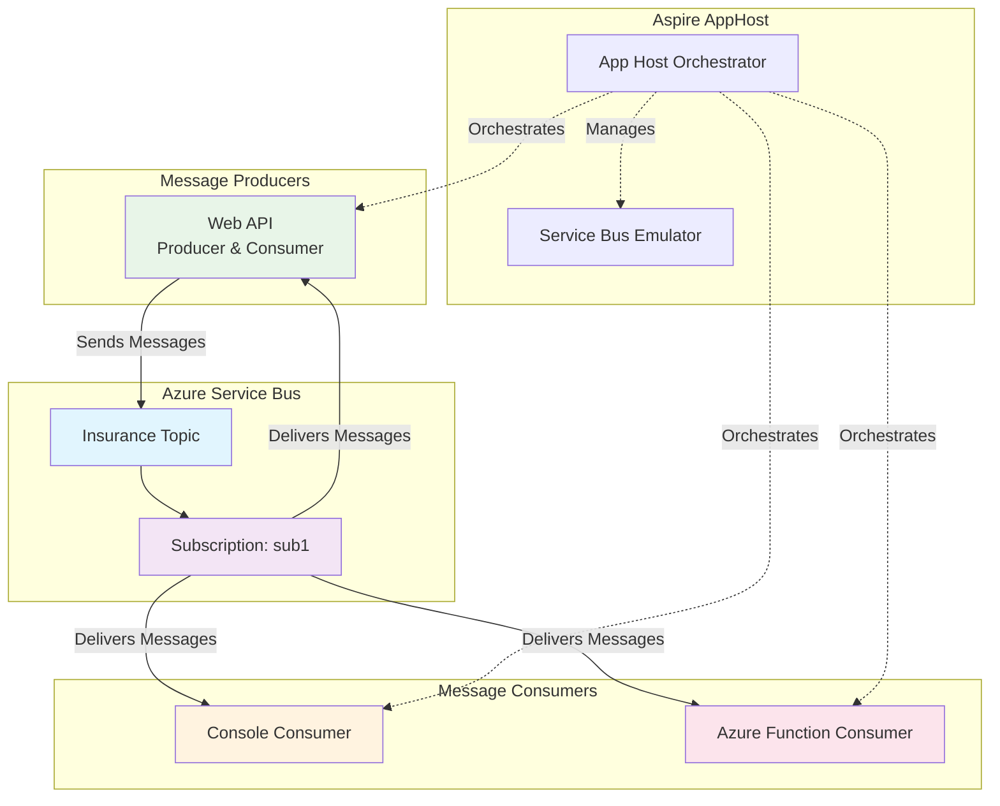

# Azure Service Bus Topic with .NET Aspire

A comprehensive demonstration of Azure Service Bus Topic/Subscription messaging pattern using .NET Aspire orchestration framework. This project showcases multiple consumer patterns including Web API, Console Application, and Azure Functions.

## 🏗️ Architecture Overview



## 📁 Project Structure

```
Aspire-ServiceBus-Topic/
├── 📂 Aspire-ServiceBus-Topic.AppHost/     # Aspire orchestration host
│   ├── Program.cs                          # Main orchestration logic
│   └── ServiceBusExtensions.cs             # Custom Service Bus extensions
├── 📂 Aspire-ServiceBus-Topic.ServiceDefaults/  # Shared service configurations
├── 📂 WebApi/                              # Web API (Producer + Consumer)
│   ├── Program.cs                          # API endpoints and setup
│   ├── ConsumerService.cs                  # Background message consumer
│   └── WebApi.http                         # HTTP test requests
├── 📂 ConsoleConsumer/                     # Console application consumer
│   ├── Program.cs                          # Console app entry point
│   └── ConsumerService.cs                  # Message processing logic
├── 📂 FunctionAppTopicConsumer/            # Azure Functions consumer
│   ├── Function1.cs                        # Service Bus triggered function
│   └── host.json                           # Function app configuration
└── README.md                               # This file
```

## 🚀 Getting Started

### Prerequisites

- [.NET 9.0 SDK](https://dotnet.microsoft.com/download/dotnet/9.0)
- [Docker Desktop](https://www.docker.com/products/docker-desktop) (for Service Bus emulator)
- [Visual Studio 2022](https://visualstudio.microsoft.com/) or [VS Code](https://code.visualstudio.com/)
- [Azure Functions Core Tools](https://docs.microsoft.com/en-us/azure/azure-functions/functions-run-local) (for Function App)

### 🔧 Installation & Setup

1. **Clone the repository**
   ```bash
   git clone <repository-url>
   cd Aspire-ServiceBus-Topic
   ```

2. **Restore NuGet packages**
   ```bash
   dotnet restore
   ```

3. **Build the solution**
   ```bash
   dotnet build
   ```

4. **Run the Aspire AppHost**
   ```bash
   cd Aspire-ServiceBus-Topic.AppHost
   dotnet run
   ```

   This will:
   - Start the Service Bus emulator in Docker
   - Launch all consumer applications
   - Open the Aspire dashboard at `https://localhost:17191`

## 🎯 Usage Examples

### 1. Sending Messages via Web API

**Using HTTP file (WebApi.http):**
```http
POST https://localhost:7071/notify
Content-Type: application/json

"Hello from Web API!"
```

**Using curl:**
```bash
curl -X POST "https://localhost:7071/notify" \
     -H "Content-Type: application/json" \
     -d "\"Your message here\""
```

**Using PowerShell:**
```powershell
Invoke-RestMethod -Uri "https://localhost:7071/notify" `
                  -Method POST `
                  -ContentType "application/json" `
                  -Body '"Hello from PowerShell!"'
```

### 2. Sending Messages via Aspire Dashboard

1. Open the Aspire dashboard at `https://localhost:17191`
2. Navigate to the **Resources** tab
3. Find the **insurance** topic resource
4. Click **SendSbMessage** command
5. This sends a "Hello World message!" to the topic

### 3. Monitoring Message Flow

**Console Output Examples:**

**Web API Consumer:**
```
New Message Consumed: Hello from Web API!
```

**Console Consumer:**
```
New Message Consumed in console: Hello from Web API!
```

**Azure Function Consumer:**
```
[2024-01-15T10:30:45.123Z] Message ID: abc123
[2024-01-15T10:30:45.124Z] Message Body: Hello from Web API!
[2024-01-15T10:30:45.125Z] Message Content-Type: 
```

## 🔍 Key Components Explained

### 1. AppHost Configuration (Program.cs)

```csharp
// Create Service Bus emulator with persistent container
var serviceBus = builder.AddAzureServiceBus("sbemulator")
    .RunAsEmulator(c => c.WithLifetime(ContainerLifetime.Persistent));

// Add topic with subscription
var topic = serviceBus.AddServiceBusTopic("insurance").WithTestCommands();

topic.AddServiceBusSubscription("sub1")
    .WithProperties(subscription =>
    {
        subscription.MaxDeliveryCount = 3; // Retry failed messages 3 times
    });
```

### 2. Message Producer (WebApi/Program.cs)

```csharp
app.MapPost("/notify", async (ServiceBusClient client, string message) =>
{
    var sender = client.CreateSender("insurance");
    var messageBatch = await sender.CreateMessageBatchAsync();

    if (!messageBatch.TryAddMessage(new ServiceBusMessage(message)))
        throw new Exception("Message too large for batch.");

    await sender.SendMessagesAsync(messageBatch);
    Console.WriteLine("Message sent to topic.");
});
```

### 3. Background Service Consumer Pattern

```csharp
public class ConsumerService : BackgroundService
{
    protected override async Task ExecuteAsync(CancellationToken stoppingToken)
    {
        var processor = _serviceBusClient.CreateProcessor("insurance", "sub1");
        
        processor.ProcessMessageAsync += MessageHandler;
        processor.ProcessErrorAsync += ErrorHandler;
        
        await processor.StartProcessingAsync();
        await Task.Delay(Timeout.Infinite, stoppingToken);
    }
}
```

### 4. Azure Function Consumer Pattern

```csharp
[Function(nameof(Function1))]
public async Task Run(
    [ServiceBusTrigger("insurance", "sub1", Connection = "insurance")]
    ServiceBusReceivedMessage message,
    ServiceBusMessageActions messageActions)
{
    _logger.LogInformation("Message Body: {body}", message.Body);
    await messageActions.CompleteMessageAsync(message);
}
```

## 🛠️ Configuration Details

### Service Bus Topic Configuration

- **Topic Name:** `insurance`
- **Subscription Name:** `sub1`
- **Max Delivery Count:** 3 (messages will be dead-lettered after 3 failed attempts)
- **Connection String:** Managed by Aspire service discovery

### Aspire Service Discovery

Each consumer automatically receives the Service Bus connection string through Aspire's service discovery:

```csharp
builder.AddAzureServiceBusClient("insurance");
```

The `"insurance"` parameter matches the topic name, enabling automatic connection string resolution.

## 🧪 Testing Scenarios

### 1. Basic Message Flow Test
1. Start the application
2. Send a message via Web API
3. Verify all three consumers receive the message
4. Check Aspire dashboard for telemetry

### 2. Error Handling Test
1. Modify a consumer to throw an exception
2. Send a message
3. Observe retry behavior (up to 3 attempts)
4. Check dead letter queue after max retries

### 3. Load Testing
1. Send multiple messages rapidly
2. Monitor consumer performance in Aspire dashboard
3. Observe message distribution across consumers

## 📊 Monitoring & Observability

### Aspire Dashboard Features

- **Resource Status:** Monitor all services and their health
- **Logs:** Centralized logging from all components
- **Traces:** Distributed tracing across message flow
- **Metrics:** Performance counters and custom metrics
- **Commands:** Execute predefined actions (like sending test messages)

### OpenTelemetry Integration

The project includes automatic instrumentation for:
- HTTP requests/responses
- Service Bus operations
- Custom activities with message correlation

## 🔧 Troubleshooting

### Common Issues

1. **Docker not running**
   ```
   Error: Cannot connect to Docker daemon
   Solution: Start Docker Desktop
   ```

2. **Port conflicts**
   ```
   Error: Port 7071 already in use
   Solution: Change port in launchSettings.json or stop conflicting service
   ```

3. **Service Bus emulator not starting**
   ```
   Solution: 
   - Ensure Docker has enough memory (4GB+)
   - Check Docker logs: docker logs <container-id>
   - Restart Docker Desktop
   ```

4. **Messages not being consumed**
   ```
   Check:
   - Service Bus connection string
   - Topic and subscription names match
   - Consumer services are running
   - No exceptions in logs
   ```

### Debug Commands

```bash
# Check running containers
docker ps

# View Service Bus emulator logs
docker logs <servicebus-container-id>

# Test connectivity
curl -X POST "https://localhost:7071/notify" -H "Content-Type: application/json" -d '"test"'
```

## 🚀 Deployment Considerations

### Local Development
- Uses Service Bus emulator (Docker container)
- All services run locally
- Aspire handles orchestration

### Azure Deployment
- Replace emulator with actual Azure Service Bus
- Update connection strings
- Deploy each service independently or as container apps

### Production Recommendations
- Use Azure Service Bus Premium for better performance
- Implement proper error handling and dead letter processing
- Add authentication and authorization
- Configure monitoring and alerting
- Use managed identities for secure connections

## 🔄 What Can Be Improved

### 1. **Message Serialization**
- **Current:** Plain string messages
- **Improvement:** Use JSON serialization with strongly-typed message contracts
- **Benefit:** Better type safety and schema evolution

### 2. **Error Handling & Resilience**
- **Current:** Basic retry with dead lettering
- **Improvement:** Implement circuit breaker pattern, exponential backoff
- **Benefit:** Better fault tolerance and system stability

### 3. **Message Filtering**
- **Current:** All consumers receive all messages
- **Improvement:** Implement subscription filters and correlation filters
- **Benefit:** Selective message processing and reduced network traffic

### 4. **Security**
- **Current:** No authentication/authorization
- **Improvement:** Add Azure AD integration, managed identities
- **Benefit:** Secure access to Service Bus resources

### 5. **Monitoring & Alerting**
- **Current:** Basic logging and Aspire dashboard
- **Improvement:** Add Application Insights, custom metrics, alerts
- **Benefit:** Production-ready observability

### 6. **Message Versioning**
- **Current:** No versioning strategy
- **Improvement:** Implement message versioning and backward compatibility
- **Benefit:** Smooth system evolution and deployment

### 7. **Performance Optimization**
- **Current:** Single subscription with multiple consumers
- **Improvement:** Implement message partitioning, session-based processing
- **Benefit:** Better scalability and throughput

### 8. **Testing**
- **Current:** Manual testing only
- **Improvement:** Add unit tests, integration tests, load tests
- **Benefit:** Automated quality assurance and regression prevention

### 9. **Configuration Management**
- **Current:** Hardcoded values
- **Improvement:** Use configuration providers, Azure Key Vault
- **Benefit:** Environment-specific configurations and secret management

### 10. **Documentation**
- **Current:** Basic README
- **Improvement:** Add API documentation, architecture decision records
- **Benefit:** Better maintainability and onboarding

## 📚 Additional Resources

- [.NET Aspire Documentation](https://learn.microsoft.com/en-us/dotnet/aspire/)
- [Azure Service Bus Documentation](https://docs.microsoft.com/en-us/azure/service-bus-messaging/)
- [Service Bus Topic/Subscription Pattern](https://docs.microsoft.com/en-us/azure/service-bus-messaging/service-bus-queues-topics-subscriptions)
- [Azure Functions Service Bus Trigger](https://docs.microsoft.com/en-us/azure/azure-functions/functions-bindings-service-bus)

## 🤝 Contributing

1. Fork the repository
2. Create a feature branch
3. Make your changes
4. Add tests if applicable
5. Submit a pull request

## 📄 License

This project is licensed under the MIT License - see the LICENSE file for details.