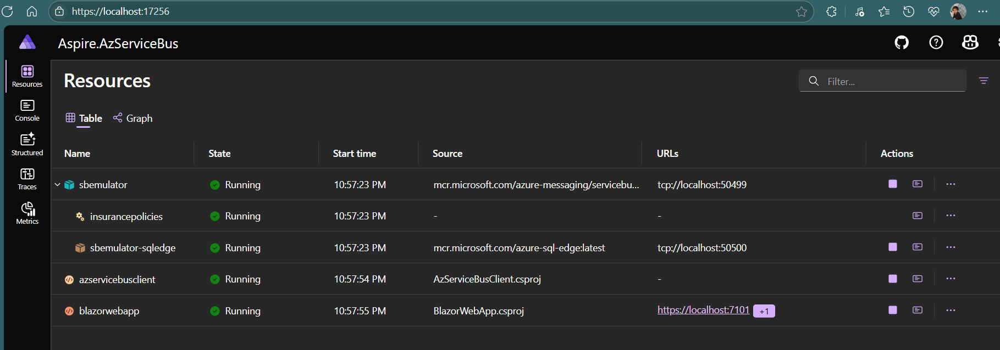

# Aspire Azure Service Bus Demo

A .NET Aspire application demonstrating Azure Service Bus integration with emulator support, featuring a Blazor web app for sending messages and a console client for receiving messages.

## Project Structure

This solution contains four projects:

### 1. **Aspire.AzServiceBus.AppHost**
- **Purpose**: Aspire orchestration host that manages the distributed application
- **Key Features**:
  - Configures Azure Service Bus emulator with `insurancepolicies` queue
  - Orchestrates service dependencies and startup order
  - Manages inter-service communication

### 2. **AzServiceBusClient**
- **Purpose**: Console application that receives and processes Service Bus messages
- **Key Features**:
  - Background service (`InsurancePolicyBusService`) for continuous message processing
  - Automatic message acknowledgment
  - Error handling and logging

### 3. **BlazorWebApp**
- **Purpose**: Web interface for sending messages to Service Bus
- **Key Features**:
  - Simple UI with text input and send button
  - Direct Service Bus client integration
  - Real-time message sending to `insurancepolicies` queue

### 4. **Aspire.AzServiceBus.ServiceDefaults**
- **Purpose**: Shared service configuration and defaults
- **Key Features**:
  - OpenTelemetry configuration for observability
  - Health checks setup
  - Service discovery configuration
  - HTTP client resilience patterns

## Prerequisites

- .NET 9.0 SDK
- Visual Studio 2022 or VS Code
- Azure Service Bus Emulator (automatically managed by Aspire)

## Getting Started

### 1. Clone and Build
```bash
git clone <repository-url>
cd Aspire.AzServiceBus
dotnet build
```

### 2. Run the Application
```bash
cd Aspire.AzServiceBus.AppHost
dotnet run
```

This will start:
- Azure Service Bus emulator
- AzServiceBusClient (message receiver)
- BlazorWebApp (message sender)
- Aspire dashboard for monitoring

### 3. Access the Applications
- **Blazor Web App**: Navigate to the URL shown in the Aspire dashboard
- **Aspire Dashboard**: Typically available at `https://localhost:15888`

## How It Works

1. **Message Flow**:
   - User enters text in the Blazor web app
   - Message is sent to `insurancepolicies` Service Bus queue
   - AzServiceBusClient receives and processes the message
   - Message processing is logged to console

2. **Service Dependencies**:
   - BlazorWebApp waits for AzServiceBusClient to be ready
   - Both services depend on Service Bus emulator availability

## Key Components

### Service Bus Configuration
```csharp
var serviceBus = builder.AddAzureServiceBus("sbemulator")
    .RunAsEmulator()
    .AddServiceBusQueue("insurancepolicies");
```

### Message Sending (Blazor)
```csharp
ServiceBusSender _sender = busClient.CreateSender("insurancepolicies");
ServiceBusMessage message = new(messageBody);
await _sender.SendMessageAsync(message);
```

### Message Receiving (Console Client)
```csharp
var processor = _serviceBusClient.CreateProcessor(queueName, new ServiceBusProcessorOptions());
processor.ProcessMessageAsync += MessageHandler;
await processor.StartProcessingAsync();
```

## Monitoring and Observability

The application includes comprehensive observability features:

- **OpenTelemetry**: Distributed tracing and metrics
- **Health Checks**: Service health monitoring
- **Aspire Dashboard**: Real-time application monitoring
- **Logging**: Structured logging with different providers

## Development Notes

- The Service Bus emulator runs automatically when starting the AppHost
- All services use the shared `ServiceDefaults` for consistent configuration
- The solution demonstrates Aspire's orchestration capabilities for cloud-native applications
- Error handling and resilience patterns are built-in through ServiceDefaults

## Troubleshooting

1. **Service Bus Connection Issues**: Ensure the emulator is running via Aspire AppHost
2. **Port Conflicts**: Check Aspire dashboard for actual service URLs
3. **Build Errors**: Verify .NET 9.0 SDK is installed and all NuGet packages are restored

## Execution


*Aspire Dashboard*


*Docker Containers*


*Blazor App - Send Message*


*Client App - Received message*

## Next Steps

- Extend message processing logic in `InsurancePolicyBusService`
- Add message serialization for complex data types
- Implement dead letter queue handling
- Add authentication for production Service Bus instances