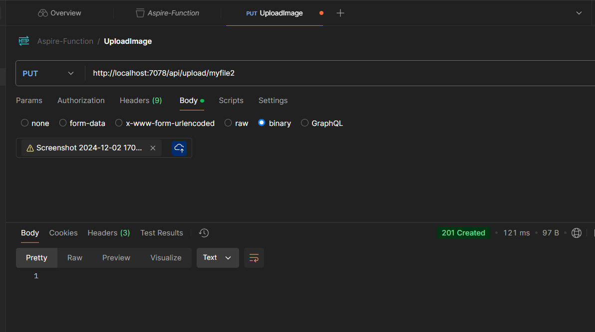

## Building Azure Functions app with .Net Aspire and Azure Storage Account

- Add the resources for Storage Account in AppHost project
- Refer the resources in the Function project
- Create the HttpTrigger Function 

**Aspire Dashboard with Resources up and running**:

**Call the function using Postman - Setting Headers**:

**Select the file in postman**:

**.Net Aspire Traces**:

**Upload the same filename and throws the error**

**Blob Trigger on Image Upload to create the thumbnail image**:

