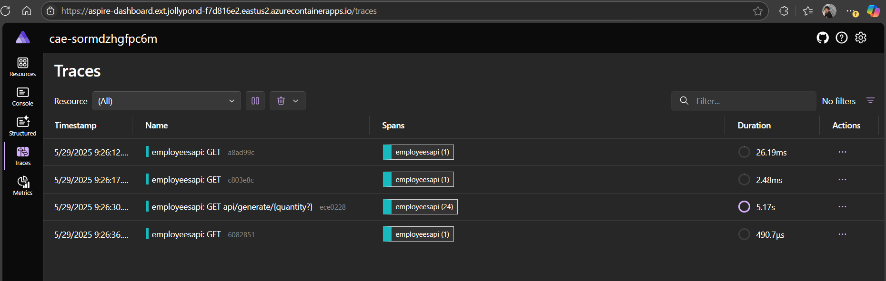

# Azure Storage Table with .NET Aspire

This project demonstrates how to use Azure Storage Table with .NET Aspire, showcasing a complete solution for building, deploying, and monitoring cloud-native applications.

## Project Overview

This sample application provides a RESTful API for managing employee data using Azure Storage Table as the data store. The application is built with .NET Aspire, which provides a streamlined developer experience for building distributed applications.

### Key Features

- **Azure Storage Table Integration**: Store and retrieve employee data using Azure Storage Table
- **RESTful API**: Endpoints for CRUD operations on employee data
- **Sample Data Generation**: Generate sample employee data with realistic values
- **Data Aggregation**: Group employees by country or by first letter of their name
- **Observability**: Built-in telemetry and tracing with .NET Aspire
- **Cloud Deployment**: Deploy to Azure Container Apps using Azure Developer CLI (azd)

## Architecture

The solution consists of the following components:

- **EmployeesApi**: ASP.NET Core Web API that provides endpoints for managing employee data
- **Aspire.AzureStorageTable.AppHost**: .NET Aspire application host that orchestrates the services
- **Aspire.AzureStorageTable.ServiceDefaults**: Common service configurations and defaults

The application uses the Aspire dashboard to visualize the application components and their relationships:

## Features Demonstration

### Generate Sample Data

The application provides an endpoint to generate sample employee data:

### View Data in Storage Explorer

You can view the generated data in the Azure Storage Explorer:

### Telemetry and Tracing

.NET Aspire provides built-in telemetry and tracing capabilities:

### Data Aggregation

The application can aggregate employee data by country:

## Deployment to Azure Container Apps

You can deploy this application to Azure Container Apps using the Azure Developer CLI (azd).

### Step 1: Initialize Azure Developer CLI

### Step 2: Configure Azure Resources

### Step 3: Review Configuration

### Step 4: Deploy to Azure

### Step 5: Deployment Progress

### Deployed Application

Once deployed, you can access the Aspire Dashboard in Azure:

And use the application to generate and view employee data:

### Application Monitoring

The deployed application provides monitoring and observability:

### Azure Resources

The deployment creates the following resources in Azure:

## Cleaning Up Resources

When you're done with the application, you can clean up the resources using the Azure Developer CLI:

## Getting Started

### Prerequisites

- .NET 9.0 SDK or later
- Azure Developer CLI (azd)
- Azure subscription (for cloud deployment)

### Running Locally

1. Clone the repository
2. Open the solution in Visual Studio or your preferred IDE
3. Run the Aspire.AzureStorageTable.AppHost project
4. Access the Aspire dashboard at the URL provided in the console
5. Use the API endpoints to interact with the application

### Deploying to Azure

1. Install the Azure Developer CLI (azd)
2. Run `azd init` in the project directory
3. Run `azd up` to deploy the application to Azure
4. Access the deployed application using the URL provided in the output

## Technologies Used

- .NET 9.0
- .NET Aspire
- Azure Storage Table
- Azure Container Apps
- Azure Developer CLI (azd)
- OpenTelemetry for observability