# Running CosmosDB Emulator in .Net Aspire and Perform simple CRUD.

- Provisioning the Resources. Here while provisioning the Cosmos DB container, our API project will be in wait state.

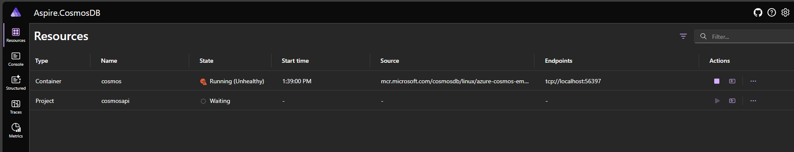

- Pulling the new Image and running the Cosmos emulator in docker desktop.

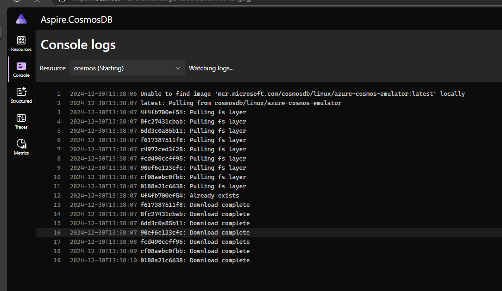

- CosmosDB is Initialized and Healthy

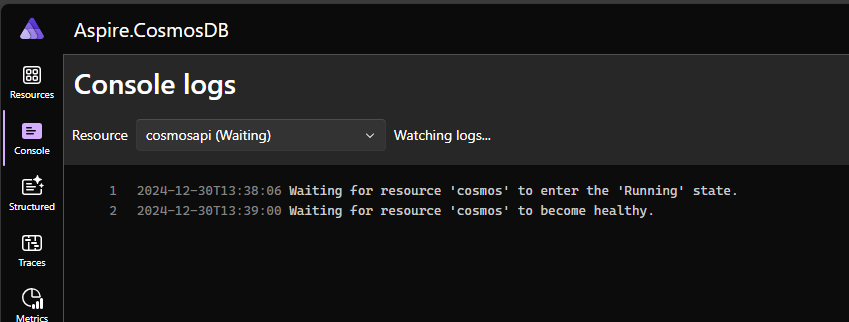

- Now the Aspire Dashboard is updated with the healthy status of both Cosmos and API

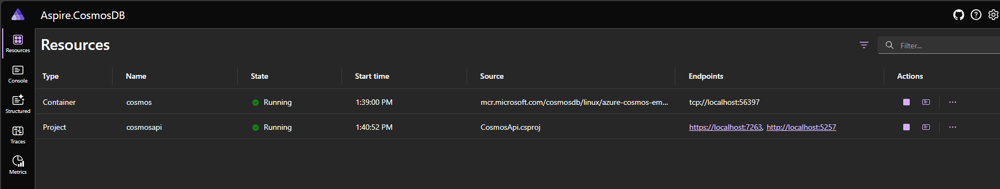

- In the Structed we can see the logs related to Database initialization.

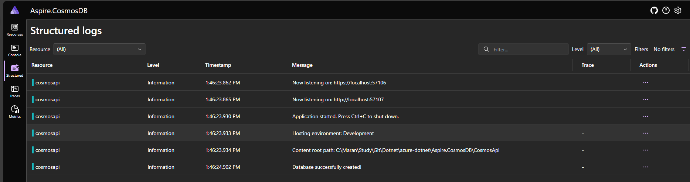

- CRUD endpoints to perform operation on Cosmos.

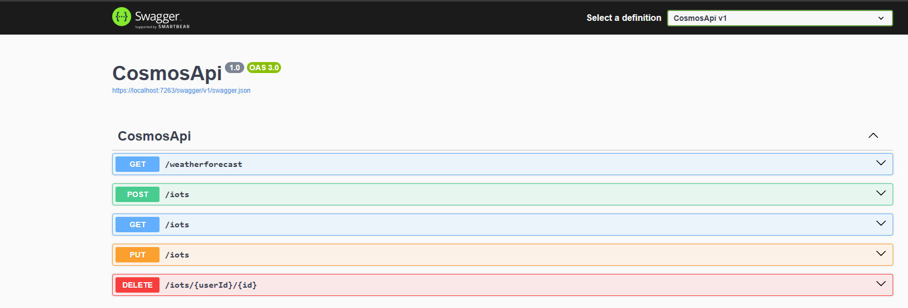

- Operation: POST

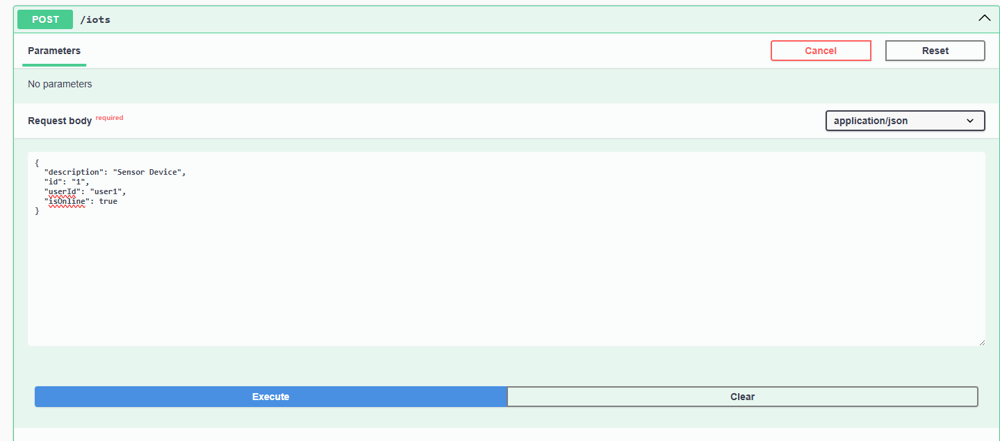

- Operation: GET

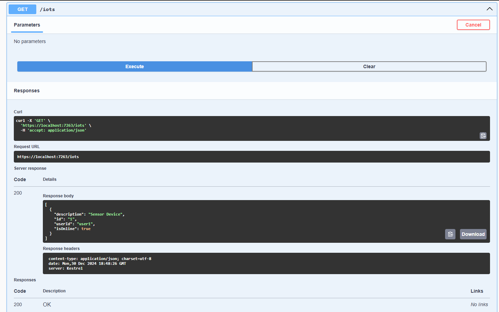

- Operation: PUT

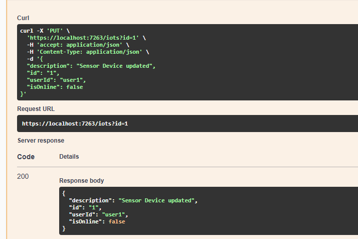

- Operation: GET to view the Changes

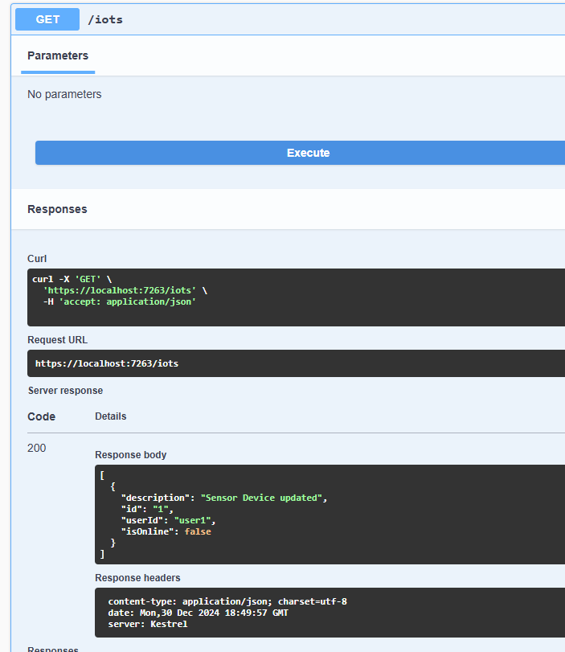

- Operation : DELETE

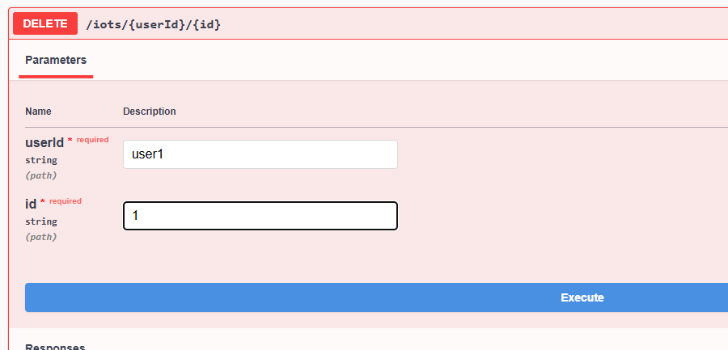

- Traces in .Net Aspire Dashboard

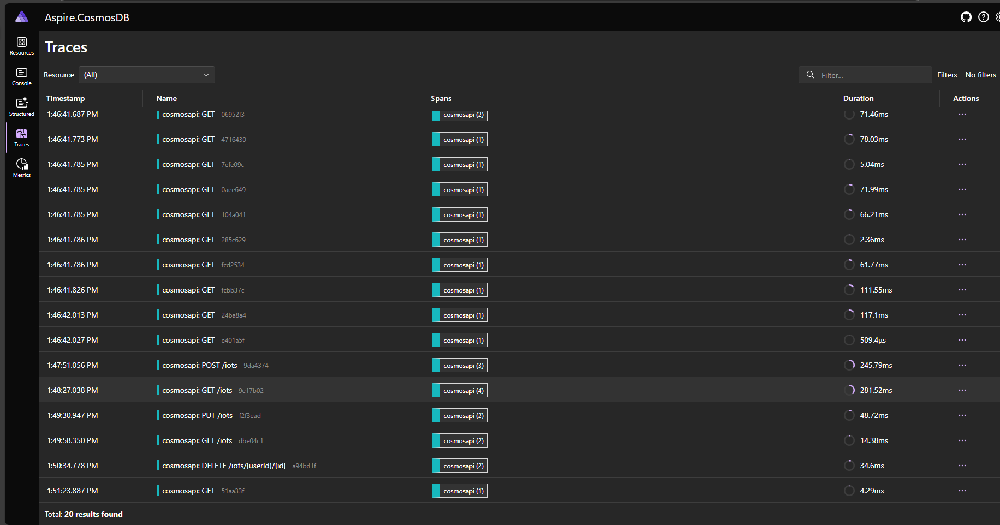