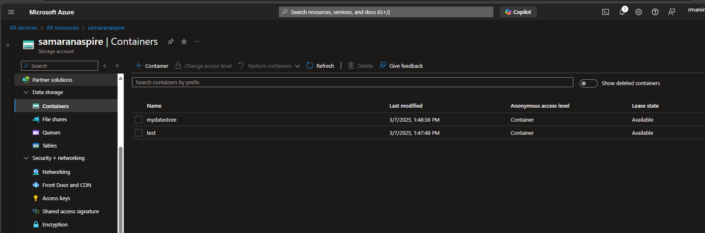
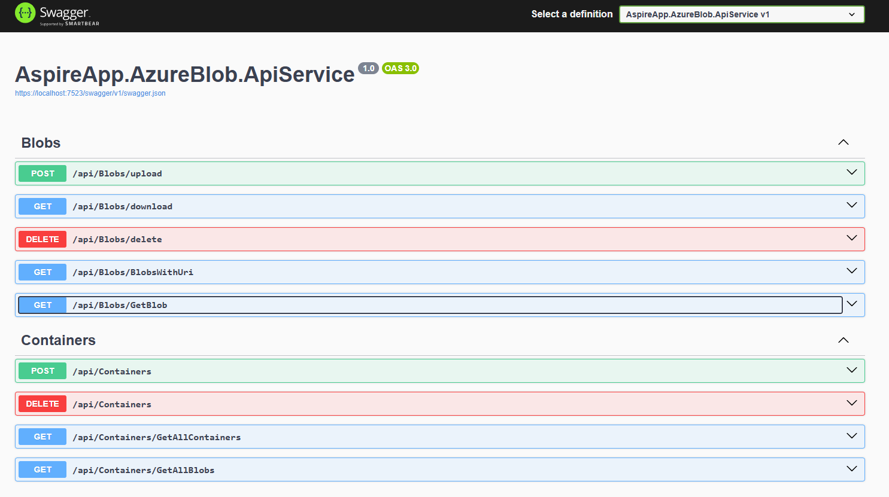

# Integrate .Net Aspire with Azure Blob Storage

## Overview
This project demonstrates the integration of .NET Aspire with Azure Blob Storage, showcasing how to build cloud-native applications using Microsoft's latest application stack. .NET Aspire provides a seamless way to develop, deploy, and monitor cloud-native applications while Azure Blob Storage offers scalable, secure object storage in the cloud.

## Prerequisites
- .NET 9.0 SDK or later
- Visual Studio 2022 (17.9 or later) or VS Code
- Azure subscription
- Azure CLI (optional)

## Features
- Azure Blob Storage integration with .NET Aspire
- CRUD operations for blob management
- Container management
- Structured logging and monitoring
- Cloud-native configuration management

## Getting Started

1. Sign in to the Azure Portal
2. Create a new Storage Account
3. Configure the account settings as shown 
below:

### Create Storage Account

## Api Endpoints
The application exposes the following REST endpoints for blob operations:

## Create Container

### Aspire Dashboard
.NET Aspire provides built-in monitoring and observability features through its dashboard:

## Configuration

### Connection String Setup
1. Store your Azure Storage connection string in user secrets or environment variables
2. Configure the connection in your Aspire service configuration

## Best Practices
- Use managed identities when possible
- Implement retry policies for resilience
- Follow the principle of least privilege
- Implement proper error handling
- Use async operations for better performance

## Security Considerations
- Secure your connection strings
- Use SAS tokens for limited access
- Enable Azure Storage encryption
- Implement proper CORS policies if needed
