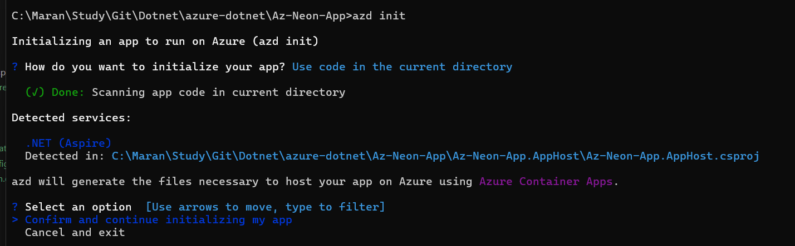
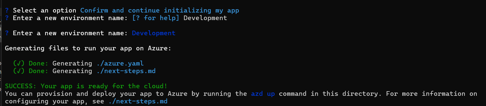
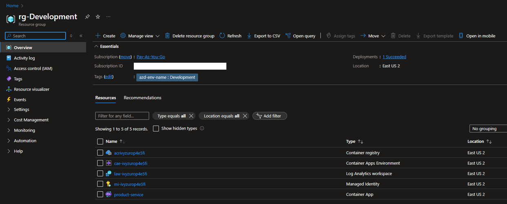
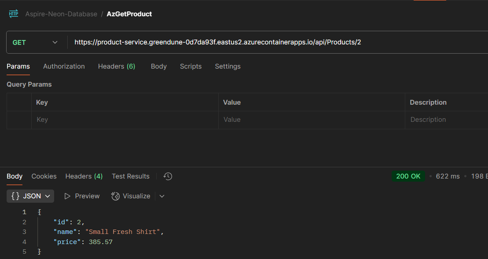
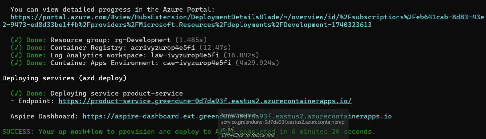
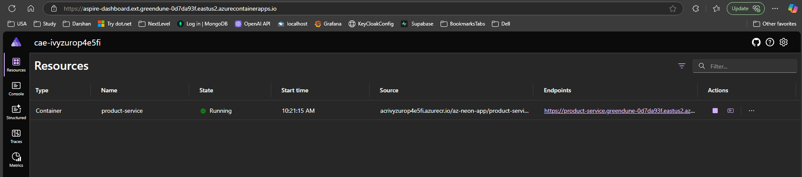

## Deploying .NET Aspire Application to Azure with Postgres sql in Neon

## Overview
This project demonstrates how to deploy a .NET Aspire application to Azure, integrated with a PostgreSQL database hosted on Neon. The application showcases a modern cloud-native architecture using Microsoft's latest cloud-native stack.

## Prerequisites
- .NET 9.0 SDK
- Azure Developer CLI (azd)
- Azure subscription
- Entity Framework Core tools

## Database Migrations
To create and manage database migrations, use the Entity Framework Core CLI tools. Execute the following command to create a new migration:

```powershell
> dotnet ef migrations add initialCreate --project .\ProductsApp.Infrastructure\ProductsApp.Infrastructure.csproj --startup-project .\EcommerceApp\EcommerceApp.Host.csproj
```

## Deployment Steps

### 1. Install Azure Developer CLI (azd)
- On Windows execute the below command
```bash
winget install microsoft.azd
```

### 2. Azure Authentication
```bash
azd auth login
```

### 3. Init Azure configuration for the project.

```bash
azd init
```

### 4. Provisioning and deployment to azure
```bash
azd up
```

## Application Architecture:
The application consists of:

 - .NET Aspire orchestrator
 - Product management services
 - PostgreSQL database integration
 - Azure cloud services











- Aspire Dashboard running from Azure

