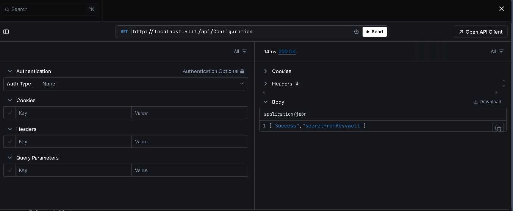

## Using Azure App Configuration and Azure KeyVault in .Net application

**Create the KeyValult and Secret**


**Create App Configuration and refer secret from KeyValult**
- Created two app config key-value pair.
  
1. Appconfig:FirstConfig 
     Type: Key-Value
     - This contains the value directly from App Config
2. Appconfig:SecondConfig
      Type: Key Vault Referece


-Install Azure Cli and connect to the Azure using
```bash
az login
```
- Install the below two packages
 1. Microsoft.Azure.AppConfiguration.AspNetCore
 2. Azure.Identity

- In the appsettings add the connection string to the Azure App Config
- Configure in connection in program.cs
- Ensure the DefaultCredential is working in the development environment. For Production, we need to use ManageIdentity instead of credentials. 

**Run the Application**
- I have used scalar to view and run the endpoints.
  


**Adding another configuration for WeatherForecastController.**


