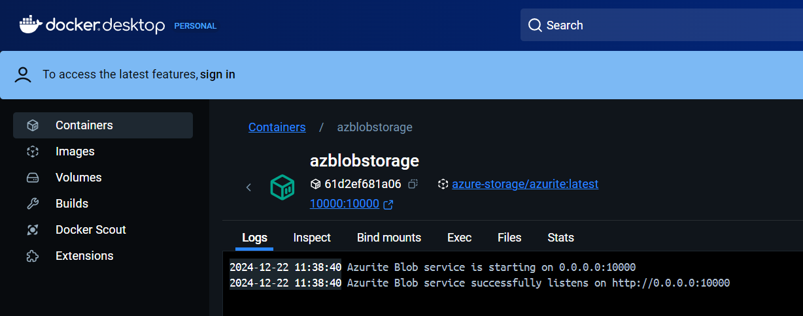
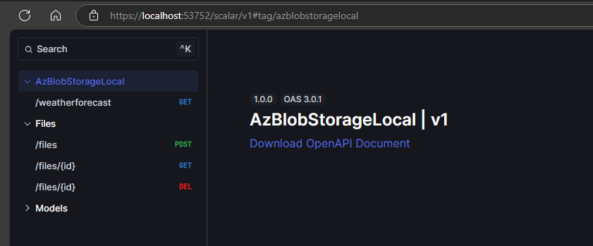
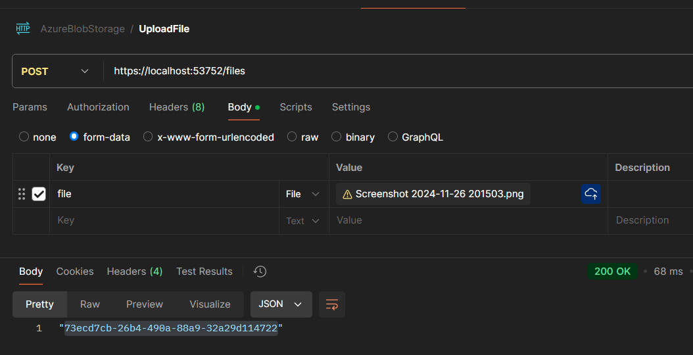
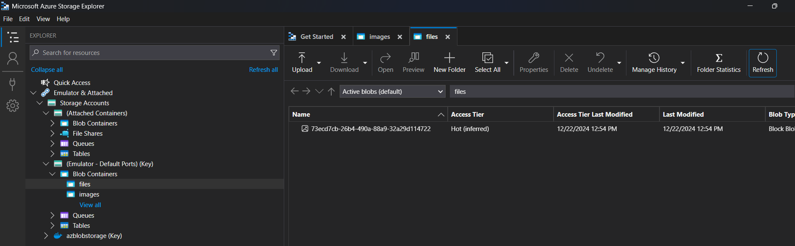
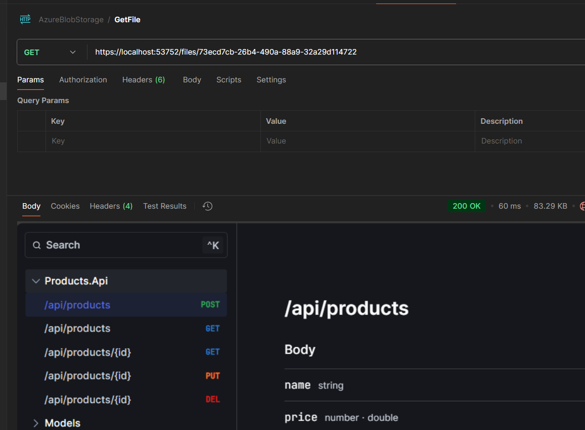
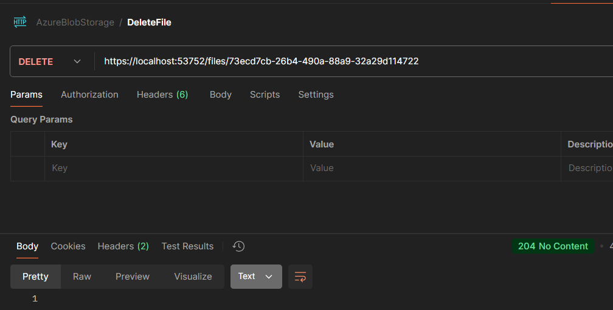
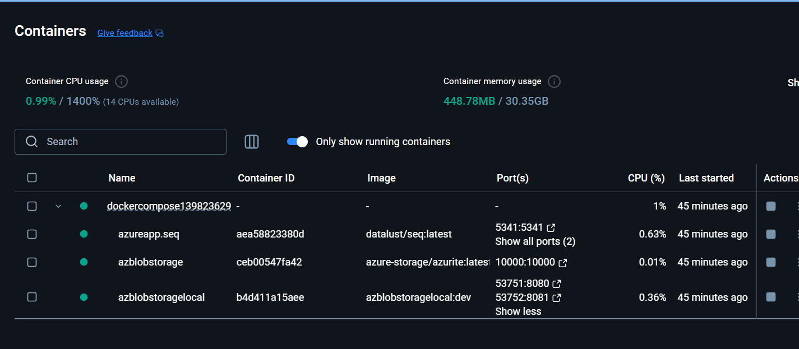

## Azure Blob Storage in Container with azurite image
- Create a Azure Storage account service in the Docker-Compose file.
- Connect to the Storage account using the Storage explorer
- Create a Container named "files".

**-Running the Container**

- **Endpoints**

- Upload file to container

- Uploaded File in Blob Container

- Get the File

- Delete the File

## Containers

