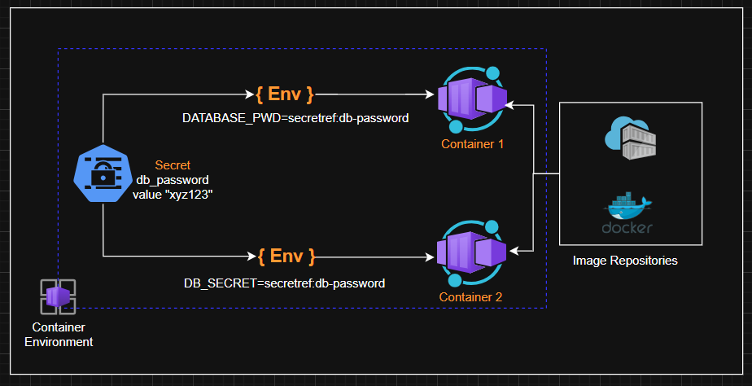
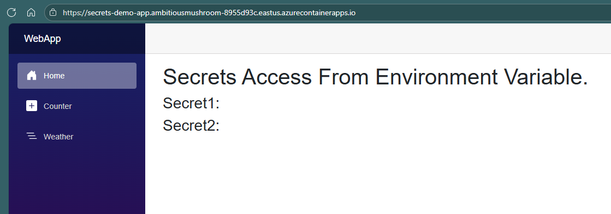
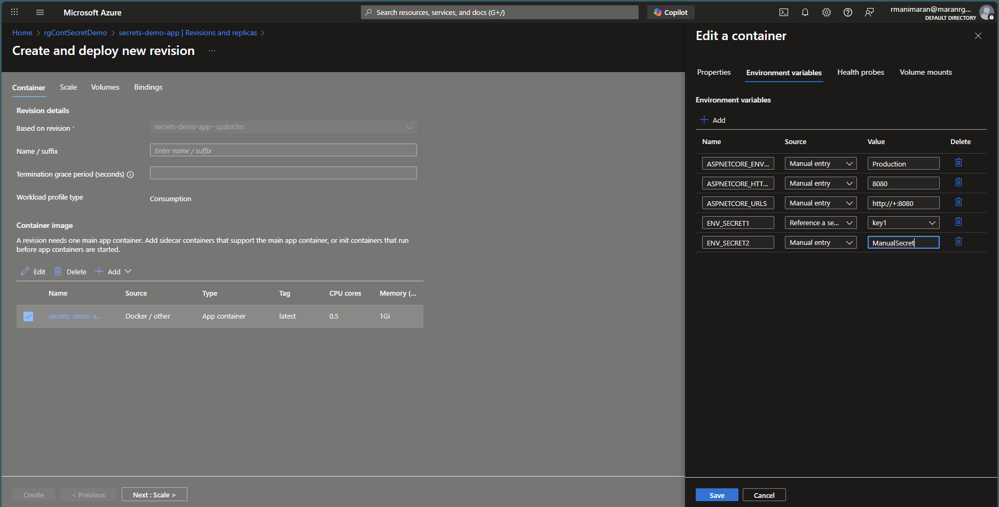
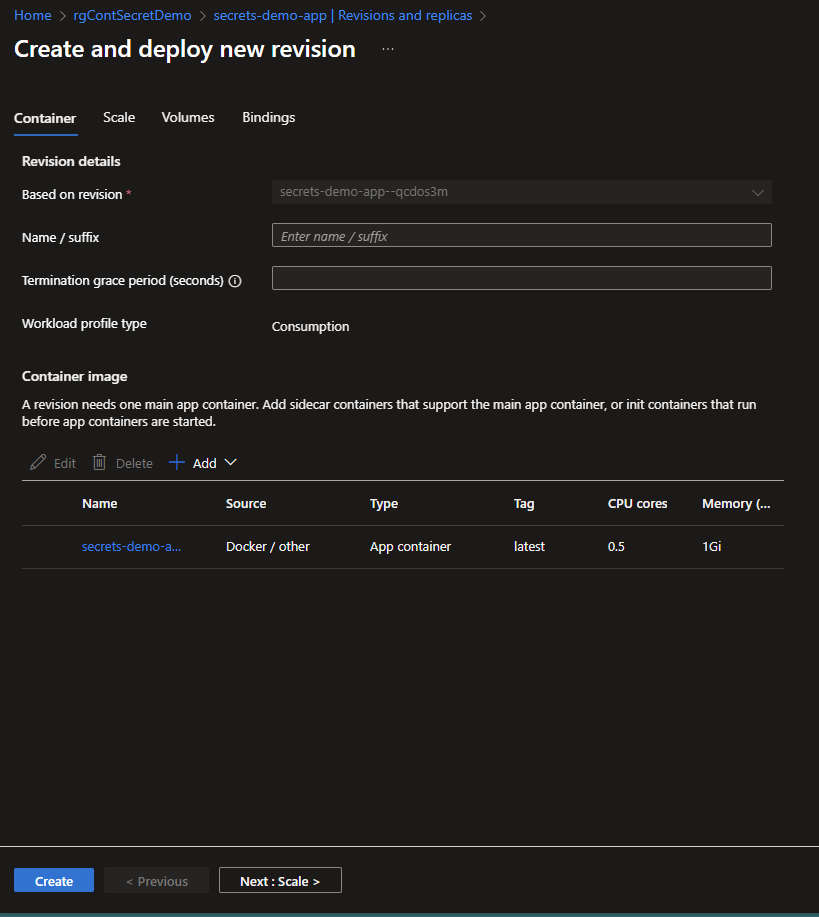
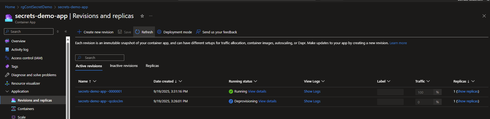
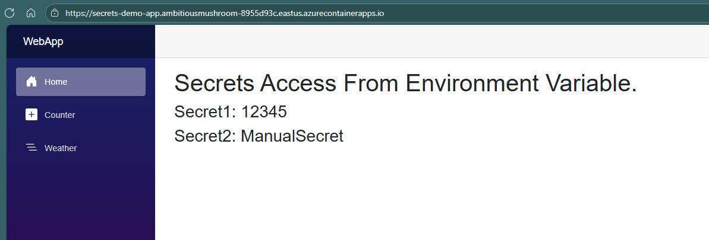
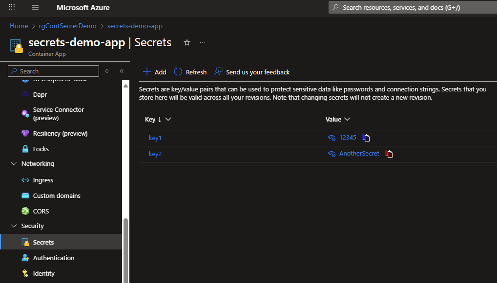
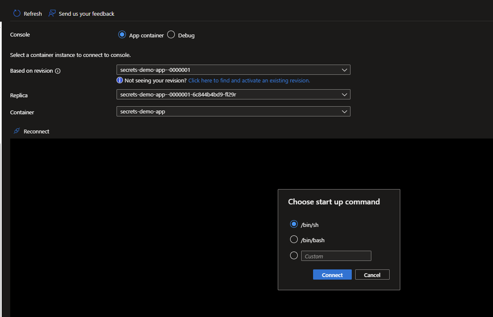
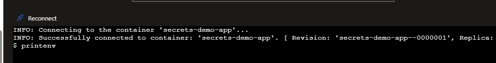
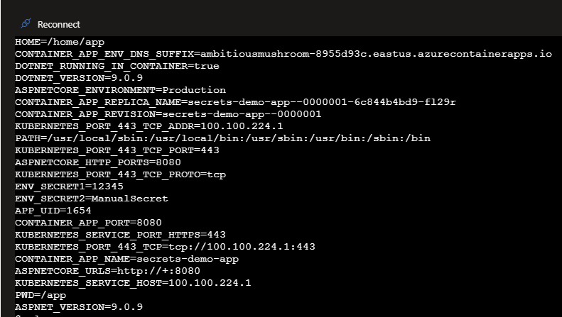

# Azure Container App Secrets Demo - Blazor Web Application

This project demonstrates how to securely manage and use secrets in Azure Container Apps by mapping them as environment variables in a containerized Blazor Server application.

## 🎯 Project Overview

This demo shows:
- How to create and manage secrets in Azure Container Apps
- Mapping secrets to environment variables in containers
- Accessing environment variables from a .NET Blazor application
- Best practices for secure secret management in containerized applications

## 🏗️ Project Structure

```
AzContainerApp_Env_Secrets/
├── WebApp/                    # Blazor Server application
│   ├── Components/           # Razor components
│   ├── Properties/           # Launch settings
│   └── Program.cs           # Application entry point
├── Deployment/              # Azure deployment scripts
│   └── deploy.ps1          # PowerShell deployment script
├── docker-compose.yml       # Local Docker testing
├── Dockerfile              # Container image definition
└── README.md               # This file
```

## 🚀 Getting Started

### Prerequisites

- [.NET 9.0 SDK](https://dotnet.microsoft.com/download)
- [Docker Desktop](https://www.docker.com/products/docker-desktop)
- [Azure CLI](https://docs.microsoft.com/en-us/cli/azure/install-azure-cli)
- [Docker Hub Account](https://hub.docker.com/) (for image hosting)
- Azure Subscription

### 1. Local Development Setup

1. **Clone the repository**
   ```bash
   git clone <repository-url>
   cd AzContainerApp_Env_Secrets
   ```

2. **Run locally**
   ```bash
   cd WebApp
   dotnet run
   ```
   Access the app at `http://localhost:5205`

### 2. Docker Testing

1. **Build and test locally with Docker**
   ```bash
   # Build the Docker image
   docker build -t containerenvapp .
   
   # Test locally
   docker run -p 8080:8080 -e ASPNETCORE_ENVIRONMENT=Production -e ASPNETCORE_HTTP_PORTS=8080 -e ASPNETCORE_URLS=http://+:8080 containerenvapp
   ```
   Access the app at `http://localhost:8080`

2. **Using Docker Compose**
   ```bash
   docker-compose up
   ```
   Access the app at `http://localhost:8080`

### 3. Push to Docker Hub

1. **Tag and push your image**
   ```bash
   docker tag containerenvapp yourusername/containerenvapp:latest
   docker push yourusername/containerenvapp:latest
   ```

## ☁️ Azure Container App Deployment

### Step 1: Update Deployment Script

Edit `Deployment/deploy.ps1` and update:
- `$res_group` - Your resource group name
- `--image` - Your Docker Hub image name

### Step 2: Deploy to Azure

1. **Login to Azure**
   ```powershell
   az login
   ```

2. **Run deployment script**
   ```powershell
   cd Deployment
   .\deploy.ps1
   ```

### Step 3: Configure Secrets

1. **Add secrets via Azure CLI**
   ```bash
   az containerapp secret set \
     --name secrets-demo-app \
     --resource-group rgSecretDemo \
     --secrets mysecret1=secretvalue1 mysecret2=secretvalue2
   ```

2. **Map secrets to environment variables**
   ```bash
   az containerapp update \
     --name secrets-demo-app \
     --resource-group rgSecretDemo \
     --set-env-vars ENV_SECRET1=secretref:mysecret1 ENV_SECRET2=secretref:mysecret2
   ```

## 🔄 Sharing Secrets Between Containers

Azure Container Apps allows you to share the same secret across multiple containers with different environment variable names. This is useful when different applications need the same secret but reference it with different variable names.

### Secret Sharing Architecture



### Implementation Steps

1. **Create a shared secret**
   ```bash
   az containerapp secret set \
     --name secrets-demo-app \
     --resource-group rgSecretDemo \
     --secrets shared-db-password=mySecretPassword123
   ```

2. **Deploy Container A with first environment variable name**
   ```bash
   az containerapp create \
     --name webapp-container \
     --resource-group rgSecretDemo \
     --environment contenv \
     --image yourusername/webapp:latest \
     --set-env-vars DATABASE_PWD=secretref:shared-db-password
   ```

3. **Deploy Container B with different environment variable name**
   ```bash
   az containerapp create \
     --name api-container \
     --resource-group rgSecretDemo \
     --environment contenv \
     --image yourusername/api:latest \
     --set-env-vars DB_SECRET=secretref:shared-db-password
   ```

### Benefits of Secret Sharing

- **Centralized Management**: Update the secret once, affects all containers
- **Consistency**: Same secret value across all applications
- **Flexibility**: Each container can use its preferred environment variable name
- **Security**: Secret is stored once and referenced multiple times

### Example Use Cases

- **Database Connection**: Multiple apps connecting to the same database
- **API Keys**: Shared third-party service credentials
- **Encryption Keys**: Common encryption/decryption across services
- **Service Tokens**: Authentication tokens for inter-service communication

### Verifying Secret Sharing

1. **Check both containers have access to the secret**
   ```bash
   # For Container A
   az containerapp exec --name webapp-container --resource-group rgSecretDemo --command "printenv | grep DATABASE_PWD"
   
   # For Container B
   az containerapp exec --name api-container --resource-group rgSecretDemo --command "printenv | grep DB_SECRET"
   ```

2. **Both should show the same secret value but with different variable names**

## 🔍 Viewing Secrets in Azure Portal

### Azure Container App Configuration


*Secrets not mapped to Env variable*


*Create Container app revision and map secrets to Env variable*


*Deploy the new revision*


*Accessing the Application with new revision*


*secrets in Container App*

### Secrets Creation


## 🔧 Troubleshooting

### View Environment Variables in Container

1. **Access Container Console**
   - In the Azure Container App, click **Console** under **Monitoring**
   - Select the `./bin/sh` login
   - In the console window type `printenv` to list all environment variables







### Common Issues

1. **Stream Timeout Error**
   - Add health check endpoint: `app.MapGet("/health", () => "Healthy");`
   - Increase startup probe timeout in deployment script

2. **Port Configuration Issues**
   - Ensure `--target-port 8080` matches your container's exposed port
   - Verify `ASPNETCORE_HTTP_PORTS=8080` environment variable

3. **Application Not Loading**
   - Check container logs: `az containerapp logs show --name secrets-demo-app --resource-group rgSecretDemo --follow`
   - Verify image works locally first

### Useful Commands

```bash
# Check container app status
az containerapp show --name secrets-demo-app --resource-group rgSecretDemo

# View application logs
az containerapp logs show --name secrets-demo-app --resource-group rgSecretDemo --follow

# List revisions
az containerapp revision list --name secrets-demo-app --resource-group rgSecretDemo

# Update container app with new image
az containerapp update --name secrets-demo-app --resource-group rgSecretDemo --image yourusername/containerenvapp:latest
```

## 🔐 Security Best Practices

1. **Never hardcode secrets** in your application code or Docker images
2. **Use Azure Container App secrets** for sensitive configuration
3. **Map secrets to environment variables** using `secretref:` syntax
4. **Rotate secrets regularly** through Azure portal or CLI
5. **Use least privilege access** for service principals and managed identities

## 📚 Additional Resources

- [Azure Container Apps Documentation](https://docs.microsoft.com/en-us/azure/container-apps/)
- [Managing Secrets in Container Apps](https://docs.microsoft.com/en-us/azure/container-apps/manage-secrets)
- [Blazor Server Documentation](https://docs.microsoft.com/en-us/aspnet/core/blazor/)
- [Docker Best Practices](https://docs.docker.com/develop/dev-best-practices/)

## 🤝 Contributing

Feel free to submit issues and enhancement requests!

## 📄 License

This project is for educational purposes and demonstration of Azure Container Apps secret management.
