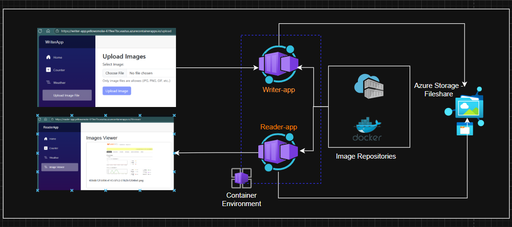
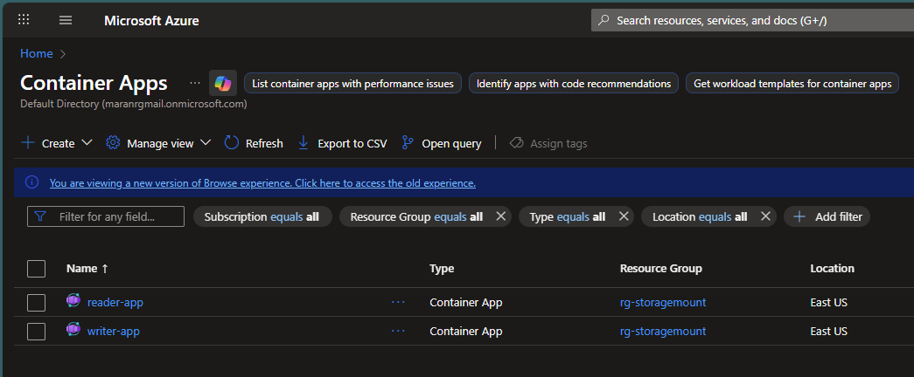
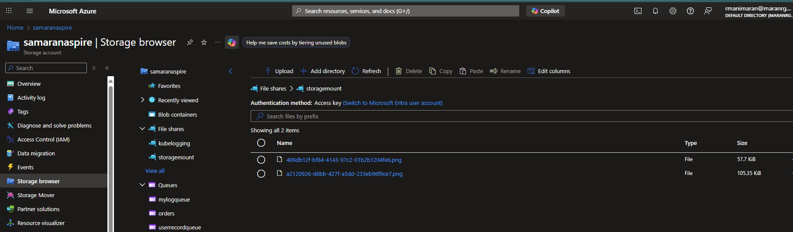
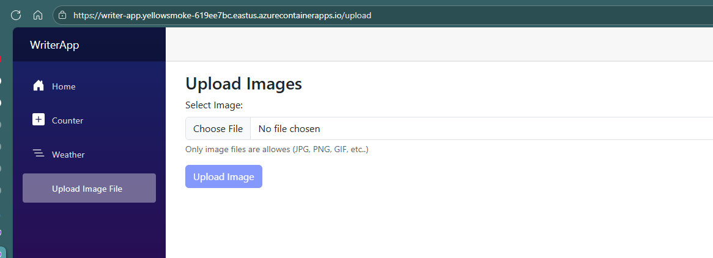
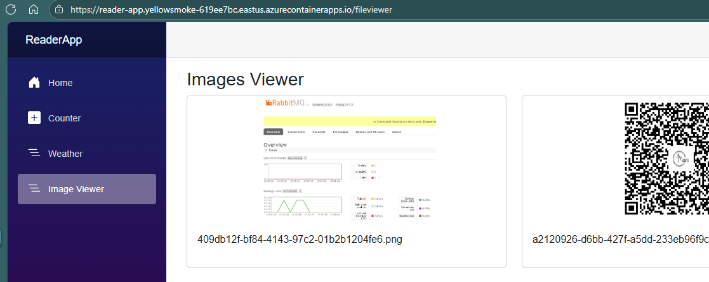

# Azure Container Apps with Volume Mount Demo

This project demonstrates how to mount Azure File Shares to Azure Container Apps for shared storage between containers. It includes two Blazor applications:
- **WriterApp**: Upload images to shared storage
- **ReaderApp**: View images from shared storage


*Architecture*

## Prerequisites

1. **Azure CLI** installed and logged in
2. **Docker** installed
3. **Azure subscription** with appropriate permissions
4. **Docker Hub account** (or Azure Container Registry)

## Step 1: Create Azure Resources

### Create Resource Group
```bash
az group create --name rg-storagemount --location "East US"
```

### Create Storage Account and File Share
```bash
# Create storage account
az storage account create --name samaranaspire --resource-group rg-storagemount --location "East US" --sku Standard_LRS

# Get storage account key
az storage account keys list --account-name samaranaspire --resource-group rg-storagemount --query "[0].value" -o tsv

# Create file share
az storage share create --name storagemount --account-name samaranaspire
```

### Create Log Analytics Workspace
```bash
az monitor log-analytics workspace create --workspace-name myloganalytics --resource-group rg-storagemount --location "East US"

# Get workspace ID and key
az monitor log-analytics workspace show --workspace-name myloganalytics --resource-group rg-storagemount --query "customerId" -o tsv
az monitor log-analytics workspace get-shared-keys --workspace-name myloganalytics --resource-group rg-storagemount --query "primarySharedKey" -o tsv
```

## Step 2: Build and Push Docker Images

### Build the Docker images
```bash
# Build WriterApp image
docker build --no-cache -t rmanimaran/writerapp -f WriterApp\Dockerfile .

# Build ReaderApp image
docker build --no-cache -t rmanimaran/readerapp -f ReaderApp\Dockerfile .
```

### Push images to Docker Hub
```bash
# Login to Docker Hub
docker login

# Push images
docker push rmanimaran/writerapp:latest
docker push rmanimaran/readerapp:latest
```

## Step 3: Deploy to Azure Container Apps

### Deploy using ARM template
```bash
az deployment group create \
  --resource-group rg-storagemount \
  --template-file scripts/storageMountDemo.json \
  --parameters \
    storage_account_key="<your-storage-account-key>" \
    loganalytics_key="<your-log-analytics-key>" \
    loganalytics_customerid="<your-log-analytics-workspace-id>"
```

**Replace the placeholders with actual values from Step 1**

## Step 4: Test the Application

### Get Container App URLs
```bash
# Get WriterApp URL
az containerapp show --name writer-app --resource-group rg-storagemount --query "properties.configuration.ingress.fqdn" -o tsv

# Get ReaderApp URL
az containerapp show --name reader-app --resource-group rg-storagemount --query "properties.configuration.ingress.fqdn" -o tsv
```

### Test the Volume Mount
1. **Upload Images**: Go to WriterApp URL → Navigate to "Upload" → Select and upload image files
2. **View Images**: Go to ReaderApp URL → Navigate to "View Images" → See uploaded images
3. **Verify Sharing**: Images uploaded in WriterApp should appear in ReaderApp (shared storage)

## Project Structure

```
├── WriterApp/              # Blazor app for uploading images
│   ├── Components/
│   ├── Controllers/
│   ├── Services/
│   └── Dockerfile
├── ReaderApp/              # Blazor app for viewing images
│   ├── Components/
│   ├── Controllers/
│   └── Dockerfile
└── scripts/
    └── storageMountDemo.json   # ARM template
```

## Key Features

- **Volume Mount**: Azure File Share mounted to `/app/images` in both containers
- **Image Upload**: WriterApp allows uploading images (JPG, PNG, GIF, etc.)
- **Image Gallery**: ReaderApp displays uploaded images in a responsive grid
- **Shared Storage**: Both apps access the same Azure File Share
- **Auto-scaling**: Container Apps scale based on demand

## Troubleshooting

### Check Container Logs
```bash
az containerapp logs show --name writer-app --resource-group rg-storagemount --follow
az containerapp logs show --name reader-app --resource-group rg-storagemount --follow
```

### Verify File Share Content
```bash
az storage file list --share-name storagemount --account-name samaranaspire
```

### Common Issues
- **Storage key expired**: Regenerate storage account key
- **File share not accessible**: Check storage account firewall settings
- **Images not appearing**: Verify volume mount path matches application code

## Clean Up Resources

```bash
az group delete --name rg-storagemount --yes --no-wait
```

## Screenshots







