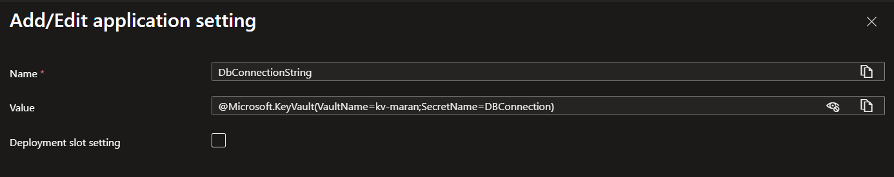
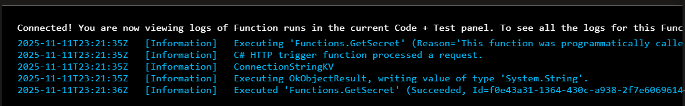

# Azure Function App Key Vault Access

## Approach 1: Using Key Vault Reference

This is the most cost-effective and simplest way to pull secrets securely. Azure automatically resolves the secret value and injects it into your app settings.

## Setup Steps

### 1. Add Application Settings

In Function App → Settings → Environment Variables, add:
- **Name:** `DBConnectionString`
- **Value:** `@Microsoft.KeyVault(VaultName=kv-maran;SecretName=DBConnection)`



### 2. Code Implementation

In your code, reference the secret using:

```csharp
string connectionString = Environment.GetEnvironmentVariable("DBConnectionString");
```

### 3. Enable Managed Identity

#### In your Function App:
1. Go to **Identity** under Settings
2. Enable **System Assigned Managed Identity**
3. **Save**


#### In your Key Vault:
1. Go to **Access Policies**
2. **Add Access Policy**
3. Select **Key Vault Secret User**
4. Select Principal - search for your Function App name and select it
5. **Save**
6. Your Function App can now access the Key Vault secret using Managed Identity

## Pros and Cons

### Pros
- No SDK or code required for Key Vault access
- Secrets are auto-rotated and cached
- No per-call cost

### Cons
- Limited flexibility (secret name and vault are fixed in configuration)

## Result

Log from the application showing the secret value retrieved from Key Vault:

