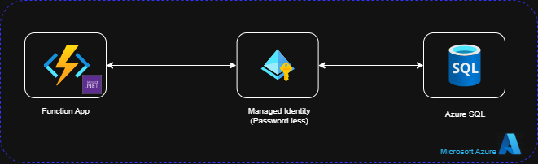
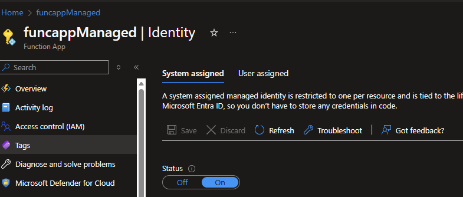
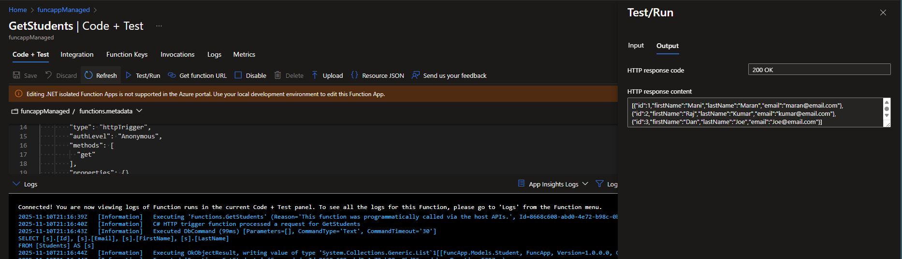

# Azure Function App with Entity Framework Core and System Managed Identity

This project demonstrates an Azure Function App using Entity Framework Core to connect to Azure SQL Database with passwordless authentication via System Managed Identity.

## Architecture

- **Azure Function App** (Consumption Plan) - Serverless compute
- **Azure SQL Database** - Data storage
- **Entity Framework Core** - ORM for data access
- **System Managed Identity** - Passwordless authentication



## Prerequisites

- Azure subscription
- Visual Studio 2022 or VS Code
- .NET 9.0 SDK
- Azure CLI (optional)

## Project Structure

```
FuncApp/
├── Models/
│   └── Student.cs              # Entity model
├── AppDbContext.cs             # EF Core DbContext
├── AppDbContextFactory.cs      # Design-time factory for migrations
├── GetStudents.cs              # HTTP trigger function
├── Program.cs                  # Function app configuration
├── local.settings.json         # Local development settings
└── FuncApp.csproj             # Project file
```

## Setup Instructions

### 1. Azure SQL Database Setup

1. Create Azure SQL Database
2. Enable "Allow Azure services and resources to access this server"

   

3. Create database schema using Entity Framework migrations:

```bash
# Add initial migration
dotnet ef migrations add InitialCreate

# Update database
dotnet ef database update
```

4. Insert sample data:

```sql
INSERT INTO Students (FirstName, LastName, Email) VALUES
('John', 'Doe', 'john.doe@email.com'),
('Jane', 'Smith', 'jane.smith@email.com'),
('Bob', 'Johnson', 'bob.johnson@email.com');
```

### 2. Function App Deployment

1. Deploy Function App to Azure using Consumption Plan
2. Enable System Managed Identity:
   - Go to Function App → Identity → System assigned → On



### 3. Database User Creation

Connect to Azure SQL Database with Azure AD authentication and create a user for the managed identity:

```sql
CREATE USER [your-function-app-name] FROM EXTERNAL PROVIDER;
ALTER ROLE db_datareader ADD MEMBER [your-function-app-name];
ALTER ROLE db_datawriter ADD MEMBER [your-function-app-name];
```

```sql
CREATE USER [funcappManaged] FROM EXTERNAL PROVIDER;

EXEC sys.sp_addrolemember
@rolename =N'db_datareader',
@membername = [funcappManaged]

Grant execute TO [funcappManaged]

Grant SELECT TO [funcappManaged]
```

### 4. Configuration

Add connection string to Function App settings:
- **Name**: `Sqldb`
- **Value**: `Server=tcp:your-server.database.windows.net,1433;Initial Catalog=your-database;Encrypt=True;TrustServerCertificate=False;Connection Timeout=30;Authentication=Active Directory Default;`

## Local Development

For local development, update `local.settings.json`:

```json
{
  "IsEncrypted": false,
  "Values": {
    "AzureWebJobsStorage": "",
    "FUNCTIONS_WORKER_RUNTIME": "dotnet-isolated",
    "Sqldb": "Server=tcp:your-server.database.windows.net,1433;Initial Catalog=your-database;User ID=your-username;Password=your-password;Encrypt=True;TrustServerCertificate=False;Connection Timeout=30;"
  }
}
```

## API Endpoints

### GET /api/GetStudents
Returns list of all students from the database.

**Response:**
```json
[
  {
    "id": 1,
    "firstName": "John",
    "lastName": "Doe",
    "email": "john.doe@email.com"
  }
]
```


## Key Features

- **Passwordless Authentication**: Uses System Managed Identity for secure database access
- **Serverless**: Consumption plan scales automatically and charges only for usage
- **Entity Framework Core**: Modern ORM with LINQ support
- **Dependency Injection**: Proper DI container setup for scalable architecture

## Security Benefits

- No connection strings with passwords stored in code
- Managed Identity handles token refresh automatically
- Azure AD integration for enterprise security
- Network isolation with Azure services firewall rule

## Troubleshooting

### Function not loading
- Check Application Insights logs
- Verify connection string configuration
- Ensure managed identity has database permissions

### Database connection issues
- Verify firewall settings allow Azure services
- Check managed identity user exists in database
- Validate connection string format

### Local development issues
- Use SQL authentication for local testing
- Ensure local.settings.json is properly configured
- Run `dotnet ef database update` for migrations

## Cost Optimization

- Consumption plan charges only for execution time
- No idle costs when function is not running
- Automatic scaling based on demand
- Pay-per-request pricing model