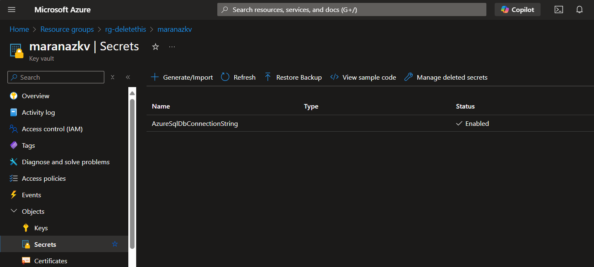

# Using Azure Key Vault for ConnectionStrings

Create Key Vault

- Create the Azure Key Vault



Create App Registration


or use Cli
```bash
> az ad sp create-for-rbac --name "myapp-service-principal" --role "Key Vault Secrets Officer" --scopes /subscriptions/{subscription-id}/resourceGroups/{resource-group}/providers/Microsoft.KeyVault/vaults/{key-vault-name}
```

```json
{
  "appId": "****-****-43e1-8e02-****",
  "displayName": "myapp-service-principal",
  "password": "**********",
  "tenant": "**************"
}

# set environment variables for service principal
set AZURE_TENANT_ID="****-****-****-*******"
set AZURE_CLIENT_ID="****-****-**-****-********"
set AZURE_CLIENT_SECRET="**.************-**"
set AZURE_IDENTITY_LOGGING_ENABLED=true

```

```
> kubectl delete deployment userregistration-api-deployment -n userregistration-api

kubectl delete all --all -n userregistration-api

```

