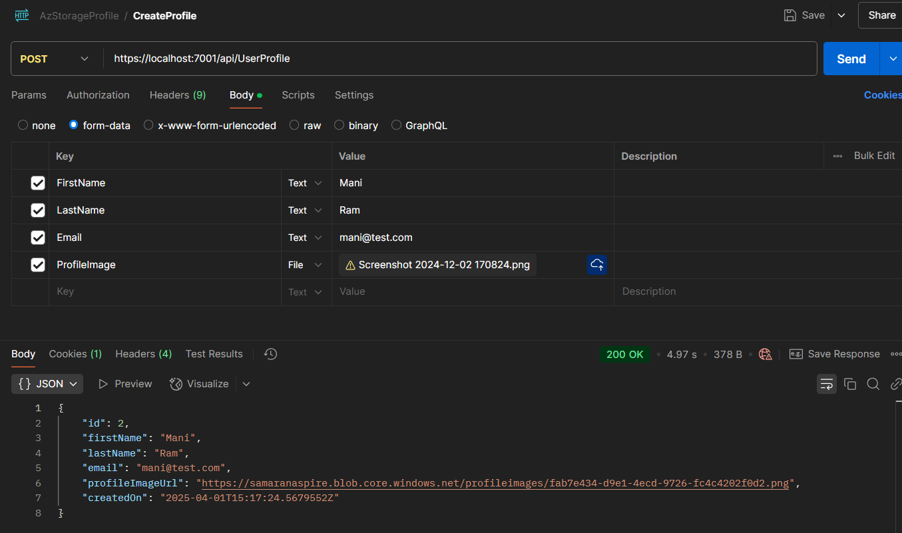
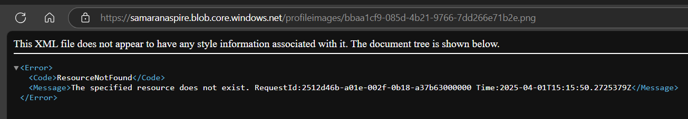
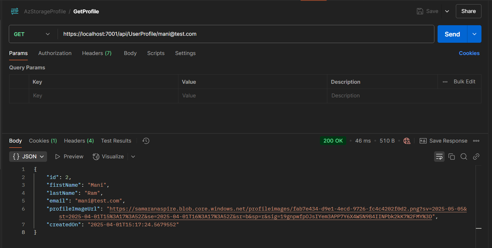
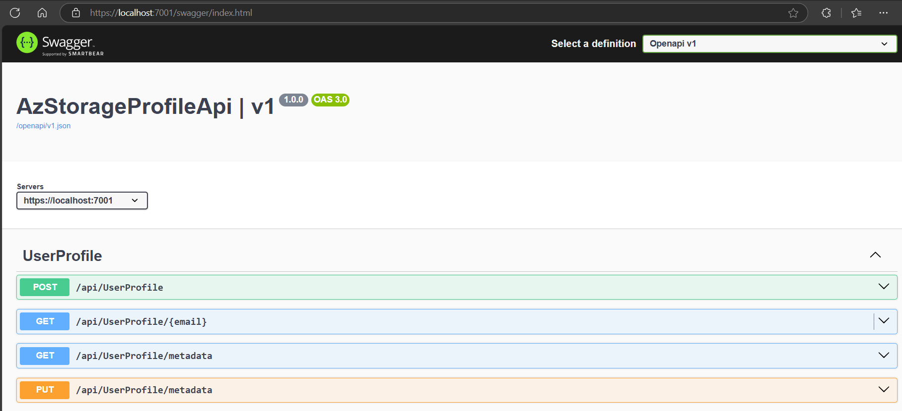
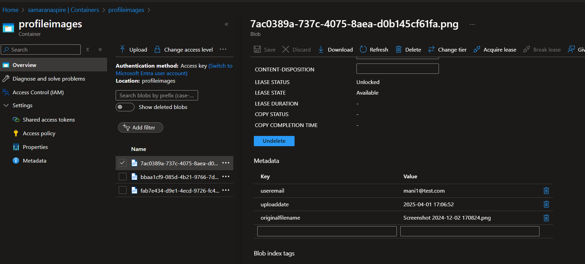
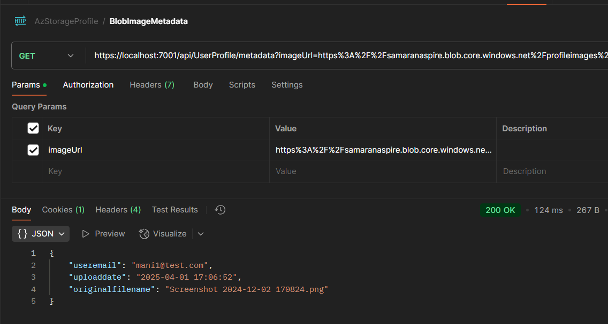

# Azure Blob Storage and SAS Token in .Net Web Api

This project demonstrates:
- SAS Token creation for images placed in private containers of Azure Blob Storage
- UserProfile creation with image upload to Azure Blob Storage
- Custom metadata management for uploaded images
- SAS token generation for secure image access

## Features

### 1. User Profile Creation
- Creates UserProfile with profile image upload to Azure Blob Storage
- Automatically adds metadata to uploaded images including:
  - User email
  - Upload date
  - Original filename

### 2. Image Storage and Access
- Stores profile images in private Azure Blob Storage containers
- Generates SAS tokens for secure, time-limited access to images
- Retrieves UserProfile data with SAS token-enabled image URLs

### 3. Metadata Management
- Adds custom metadata during image upload
- Allows retrieval of image metadata
- Supports metadata updates for existing images

## API Endpoints

### Create UserProfile Request


### Access Image URL with SAS Token
- Direct access without SAS token results in error


- Successful access with SAS token



### Metadata Management
- View metadata information in Azure Storage


- Access metadata through API endpoint


## Implementation Details

### Image Upload with Metadata
```csharp
public async Task<string> UploadFileAsync(IFormFile file, string containerName, string userEmail)
{
    // ... blob client setup ...
    var metadata = new Dictionary<string, string>
    {
        { "useremail", userEmail },
        { "uploaddate", DateTime.UtcNow.ToString("yyyy-MM-dd HH:mm:ss") },
        { "originalfilename", file.FileName }
    };
    
    var blobUploadOptions = new BlobUploadOptions
    {
        Metadata = metadata
    };
    
    // ... upload implementation ...
}
```
### Metadata Operations
 - Retrieve metadata for uploaded images

 - Update metadata for existing images

 - Track user-related information with images

### Security Features

- Private container access

- SAS token-based authentication

- Time-limited access tokens

- Secure metadata storage
