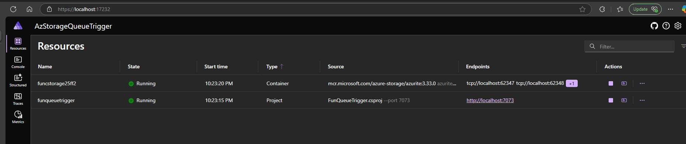
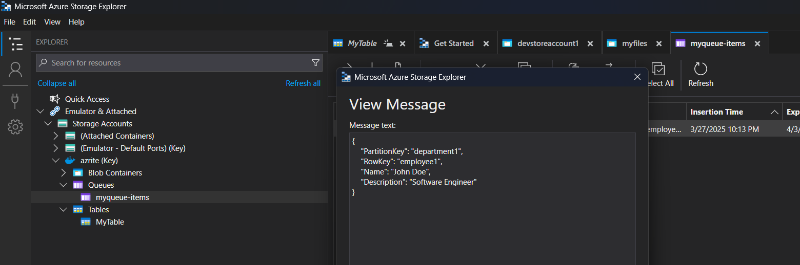
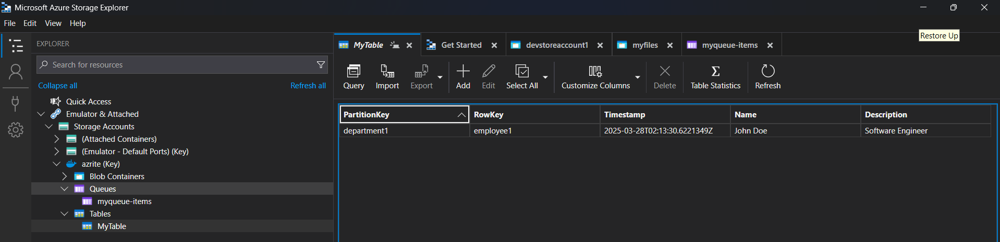

# Azure Storage Queue Trigger Function App
- Azure Functions get trigger when new item get  placed in the Azure Queue.
- The Message will be parsed and for messege persistence the information will be stored in Azure Storage Table
- If the table does not exists, it will automatically create the Azure Storage Table

## .Net Aspire

## Created the Azure Queue Item

## Azure Function Triggered and created the Azure Storage Table and entry

