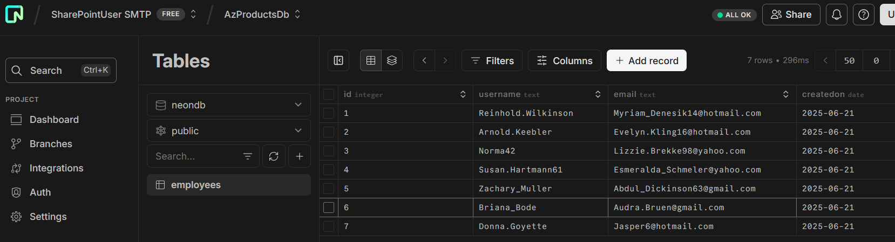

# Azure Timer Function App

A .NET 9 Azure Functions application that demonstrates timer-triggered functions, blob storage operations, queue processing, and database integration using Azure services.

## Architecture Overview


## Project Structure

```
AzTimerFuncApp/
├── EmailNotificatonTimer/          # Main Azure Functions project
│   ├── Models/                     # Data models
│   │   ├── Employee.cs            # Employee entity
│   │   ├── EmailBlobFile.cs       # Blob file metadata
│   │   ├── QueueMessage.cs        # Queue message model
│   │   └── About.cs               # Function metadata
│   ├── Services/                   # Business logic services
│   │   └── EmployeeService.cs     # Employee database operations
│   ├── EmailNotificationTimer.cs  # Timer-triggered function
│   ├── FileIngestTrigger.cs       # Queue-triggered function
│   ├── Program.cs                 # Application startup
│   └── host.json                  # Function host configuration
└── AzureStorageUtility/           # Shared utility library
    ├── AzureBlobStorageUtility.cs # Blob storage operations
    ├── AzureQueueUtility.cs       # Queue operations
    ├── BlobStorageAuthMode.cs     # Authentication modes
    └── Utilities.cs               # Helper methods
```

## Features

### Timer Function (`EmailNotificationTimer`)
- **Trigger**: Configurable cron schedule via `ExecutionScheduleTime` environment variable
- **Functionality**:
  - Generates random employee data using Bogus library
  - Creates timestamped log files
  - Uploads files to Azure Blob Storage
  - Ensures container existence before upload
  - Logs function metadata and execution details

### Queue Function (`FileIngestTrigger`)
- **Trigger**: Azure Storage Queue messages
- **Functionality**:
  - Processes Event Grid blob creation events
  - Downloads blob content from storage
  - Deserializes JSON content to Employee objects
  - Inserts employee data into PostgreSQL database
  - Handles various blob file formats

### Storage Utility Library
- **Multiple Authentication Modes**:
  - Managed Identity
  - User-Assigned Managed Identity
  - Connection String
  - Key Vault SAS Token
- **Blob Operations**: Upload, download, delete, list
- **Container Management**: Create, delete, check existence
- **Built-in Retry Logic**: Configurable retry attempts with exponential backoff

## Technology Stack

- **.NET 9**: Latest .NET framework
- **Azure Functions v4**: Serverless compute platform
- **Azure Blob Storage**: File storage and management
- **Azure Storage Queues**: Message queuing service
- **PostgreSQL**: Relational database with Npgsql driver
- **Dapper**: Lightweight ORM for database operations
- **Serilog**: Structured logging framework
- **Bogus**: Fake data generation library
- **Azure Key Vault**: Secrets management
- **Azure Managed Identity**: Secure authentication

## Configuration

### Environment Variables

| Variable | Description | Required |
|----------|-------------|----------|
| `ExecutionScheduleTime` | Cron expression for timer trigger | Yes |
| `BlobStorageUri` | Azure Storage account URI | Yes |
| `AuthMode` | Authentication mode (enum) | Yes |
| `KeyVaultUri` | Key Vault URI (if using KeyVault auth) | Conditional |
| `KeyVaultSecretName` | Secret name in Key Vault | Conditional |
| `ManagedIdentityClientId` | Client ID for user-assigned MI | Conditional |
| `StorageContainerName` | Blob container name | Yes |
| `QueueName` | Storage queue name | Yes |
| `QueueConnectionString` | Queue connection string | Yes |
| `DbConnectionString` | PostgreSQL connection string | Yes |

### Authentication Modes

1. **ManagedIdentity**: Uses system-assigned managed identity
2. **UserAssignedManagedIdentity**: Uses user-assigned managed identity
3. **ConnectionString**: Uses storage account connection string
4. **KeyVaultSasToken**: Retrieves SAS token from Key Vault

## Setup Instructions

### Prerequisites
- .NET 9 SDK
- Azure subscription
- Azure Storage Account
- PostgreSQL database
- Azure Functions Core Tools

### Local Development

1. **Clone the repository**
   ```bash
   git clone <repository-url>
   cd AzTimerFuncApp
   ```

2. **Configure local settings**
   ```json
   {
     "IsEncrypted": false,
     "Values": {
       "AzureWebJobsStorage": "UseDevelopmentStorage=true",
       "FUNCTIONS_WORKER_RUNTIME": "dotnet-isolated",
       "ExecutionScheduleTime": "0 */5 * * * *",
       "BlobStorageUri": "https://yourstorageaccount.blob.core.windows.net/",
       "AuthMode": "ConnectionString",
       "StorageContainerName": "mylogfiles",
       "QueueName": "mylogqueue",
       "QueueConnectionString": "DefaultEndpointsProtocol=https;AccountName=...",
       "DbConnectionString": "Host=localhost;Database=employees;Username=user;Password=pass"
     }
   }
   ```

3. **Database Setup**
   ```sql
   CREATE TABLE Employees (
       Id SERIAL PRIMARY KEY,
       UserName VARCHAR(100) NOT NULL,
       Email VARCHAR(255) NOT NULL,
       CreatedOn TIMESTAMP NOT NULL
   );
   ```

4. **Build and run**
   ```bash
   dotnet build
   cd EmailNotificatonTimer
   func start
   ```

### Azure Deployment

1. **Create Azure resources**
   - Function App
   - Storage Account
   - PostgreSQL Flexible Server
   - Key Vault (optional)
   - Managed Identity

2. **Configure Function App settings**
   - Add all required environment variables
   - Enable Managed Identity
   - Grant storage permissions

3. **Deploy the application**
   ```bash
   func azure functionapp publish <function-app-name>
   ```

## Usage Examples

### Timer Function Execution
The timer function runs automatically based on the configured schedule:
- Generates employee data
- Creates log files with timestamps
- Uploads to blob storage
- Logs execution metadata

### Queue Processing
When blobs are created in the storage account:
1. Event Grid sends notification to queue
2. Queue trigger processes the message
3. Function downloads and processes the blob
4. Employee data is extracted and stored in database

## Monitoring and Logging

- **Structured Logging**: Uses Serilog for consistent log formatting
- **Function Metadata**: Tracks version, instance, and execution status
- **Error Handling**: Comprehensive exception handling with detailed logging
- **Retry Logic**: Built-in retry mechanisms for storage operations

## Security Considerations

- **Managed Identity**: Eliminates need for connection strings in code
- **Key Vault Integration**: Secure storage of sensitive configuration
- **Least Privilege**: Functions only have necessary permissions
- **Connection String Protection**: Database credentials stored securely

## Execution 





## Contributing

1. Fork the repository
2. Create a feature branch
3. Make your changes
4. Add tests if applicable
5. Submit a pull request

## License

This project is licensed under the MIT License - see the LICENSE file for details.