# Referencing Secrets from Azure Key Vault in Azure Container Apps

This guide demonstrates how to configure Azure Container Apps to reference secrets from Azure Key Vault, both as environment variables and as mounted volumes.

## Prerequisites

- Azure subscription with appropriate permissions
- Docker image (this example uses `rmanimaran/containerenvapp:latest` from Docker Hub)
- Application with environment variables: `ENV_SECRET1` and `ENV_SECRET2`

## Part 1: Configure Environment Variables with Key Vault Secrets

### Step 1: Create Azure Container App

1. Create a new Azure Container App
2. Enable Ingress to allow external access to the application
3. Configure the container to use the Docker image: `rmanimaran/containerenvapp:latest`
   - Note: You can also use images from Azure Container Registry (ACR)

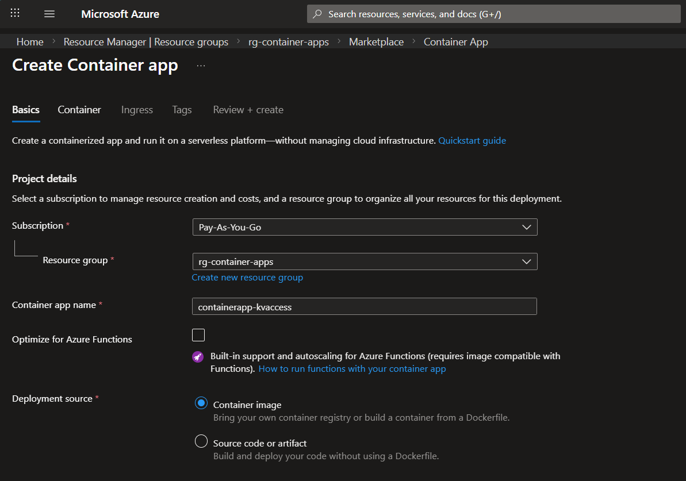

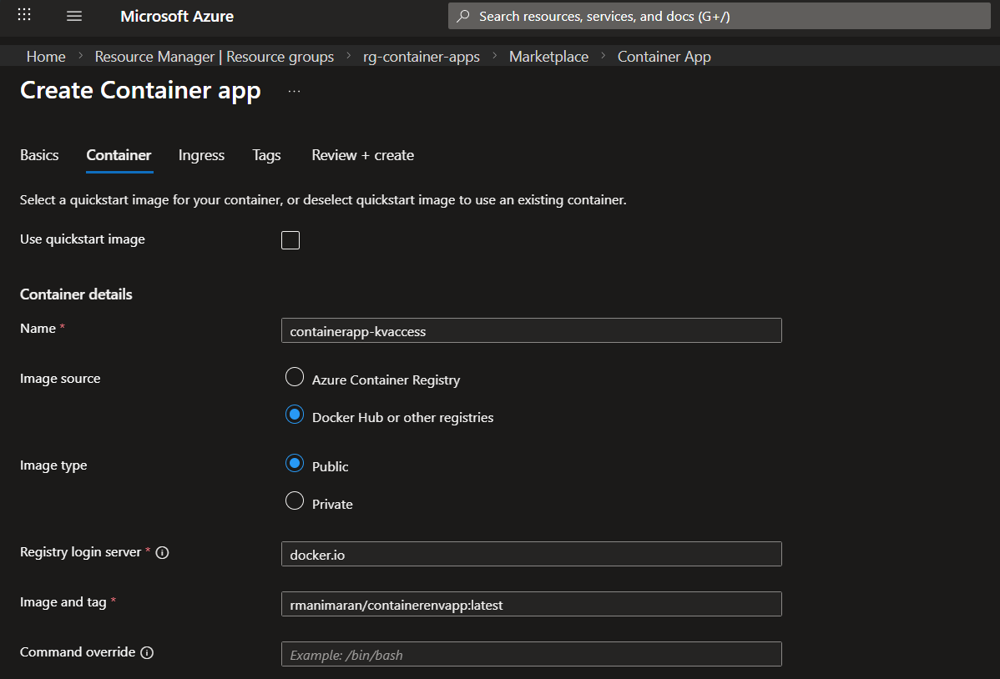

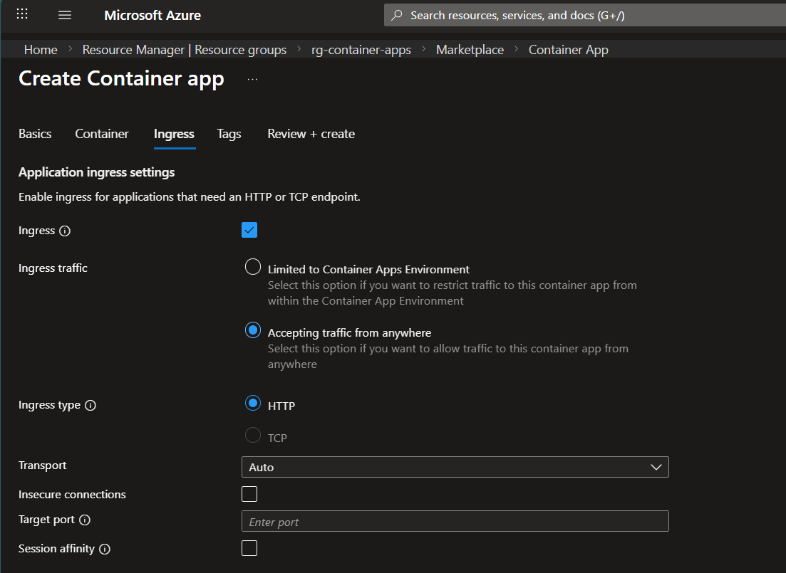

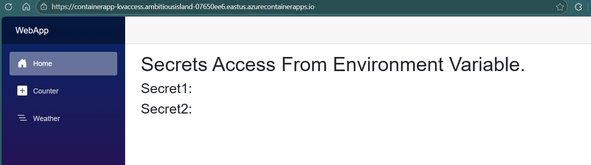


### Step 2: Create Initial Secrets

1. Create secrets in the Azure Container App
2. Create environment variables (`ENV_SECRET1`, `ENV_SECRET2`) and map them to the secrets created above

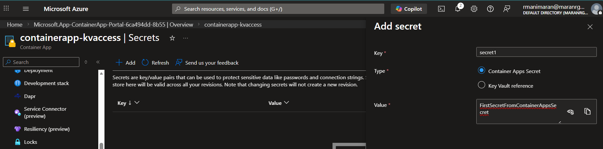

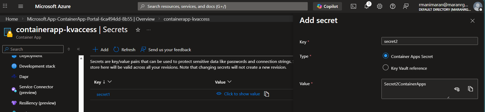

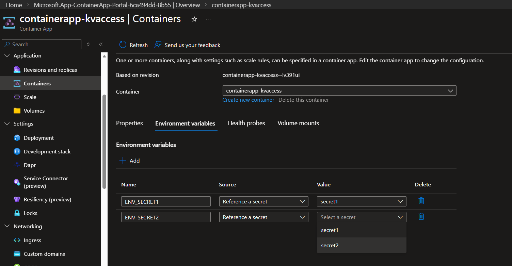

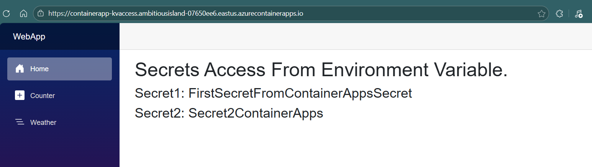

### Step 3: Create and Configure Azure Key Vault

1. Create a Key Vault named `kvazurecontainerApp`
2. Assign the **Key Vault Administrator** role to your user account
3. Create a secret in Key Vault:
   - Name: `secret2`
   - Value: `secret2FromKV`

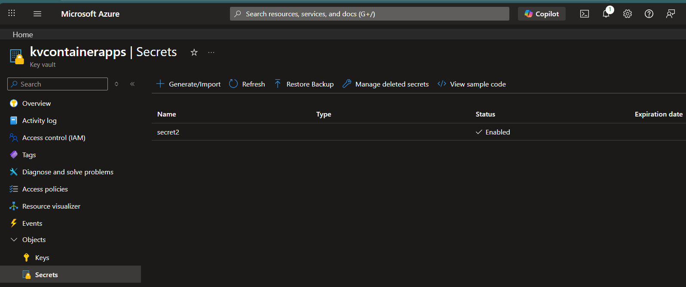

### Step 4: Configure Managed Identity

1. Enable Managed Identity for the Azure Container App
2. Assign the **Key Vault Secrets User** role to the Container App's managed identity on the Key Vault

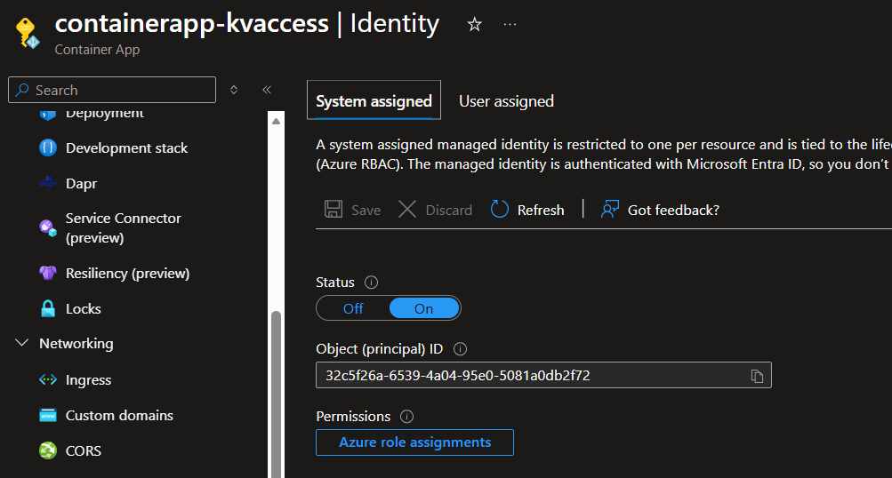

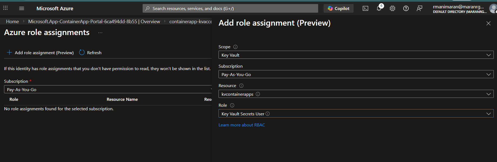

### Step 5: Update Environment Variables to Reference Key Vault

1. Edit the environment variables in the Azure Container App
2. Update the variable mapping to reference secrets from Key Vault instead of local secrets
3. Create a new revision
4. Verify that the secrets are loaded from Key Vault

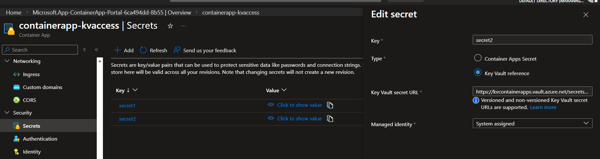

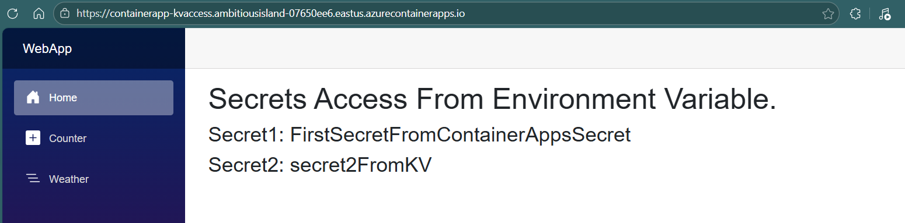

## Part 2: Mount Secrets as Volumes

Secrets can also be mounted as files in the container filesystem.

### Step 1: Create and Mount Volume

1. In the Azure Container App, create a volume named `secrets`
2. In the Volume mounts tab, select the created volume and mount it to `/mnt/secrets`
3. Create a new revision

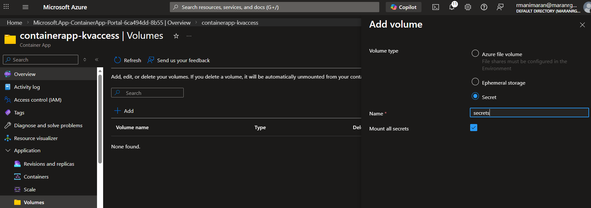

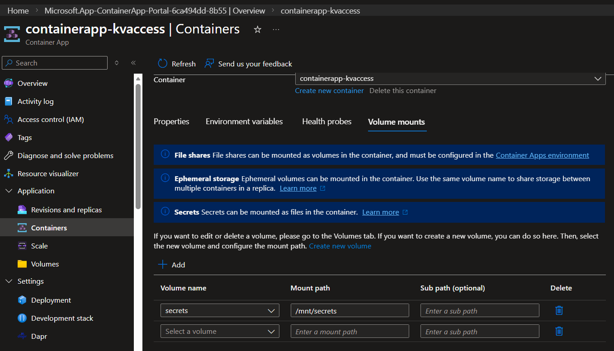

### Step 2: Verify Mounted Secrets

1. Open the Console option to access the Container App's console
2. View environment variables:
   ```bash
   printenv
   ```

3. Navigate to the mounted secrets directory and verify the secrets:
   ```bash
   cd /mnt/secrets
   
   # List the secrets in the directory
   ls
   
   # View secret contents
   cat secret1
   cat secret2
   ```

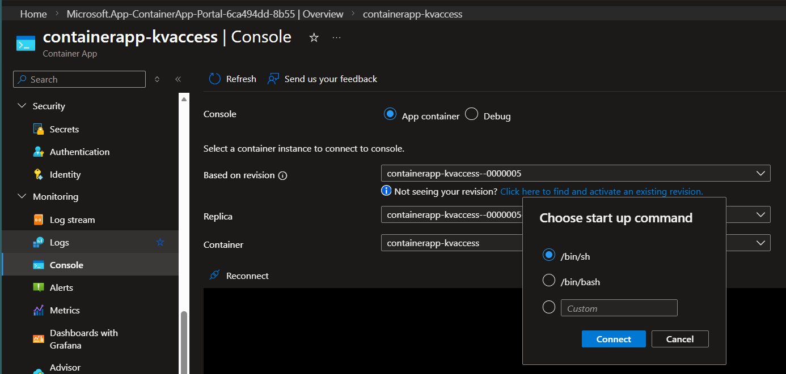

![alt text]images/image-16.png)

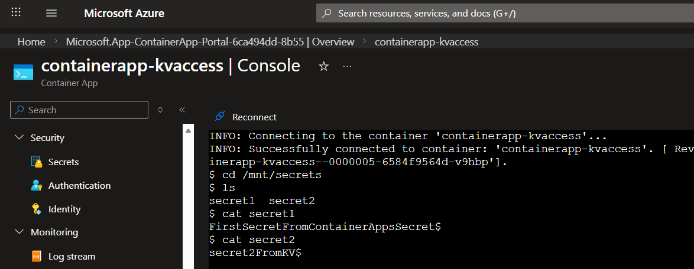

## Summary

This configuration demonstrates two methods for accessing Key Vault secrets in Azure Container Apps:
- **Environment Variables**: Secrets are injected as environment variables
- **Volume Mounts**: Secrets are mounted as files in the container filesystem at `/mnt/secrets`

Both approaches use Managed Identity for secure, credential-free authentication to Azure Key Vault.