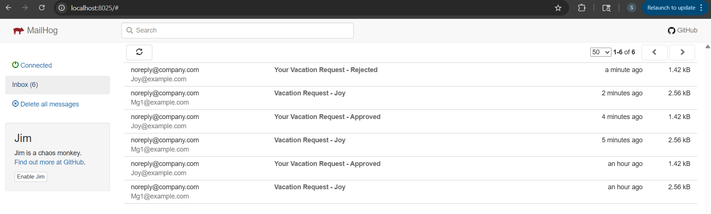

# Azure Durable Functions - Leave & Expense Approval Workflow

A professional implementation of leave and expense approval workflows using Azure Durable Functions with .NET 9, featuring email notifications, database persistence, and comprehensive error handling.

## 🚀 Features

- **Leave Request Management** - Submit, approve/reject leave requests
- **Expense Claim Processing** - Submit, validate, and approve expense claims  
- **Email Notifications** - HTML email templates with approval buttons
- **Database Persistence** - SQL Server with Entity Framework Core
- **Workflow Orchestration** - Durable Functions with timeout and escalation
- **Local Email Testing** - MailHog integration for development

## 🛠️ Technology Stack

- **.NET 9** - Latest .NET framework
- **Azure Functions v4** - Serverless compute platform
- **Durable Functions** - Workflow orchestration
- **Entity Framework Core** - Database ORM
- **SQL Server** - Database storage
- **SendGrid** - Email service (production)
- **MailHog** - Local email testing

## 🏗️ Architecture


## 🚀 Quick Start

### Prerequisites
- .NET 9 SDK
- SQL Server (LocalDB for development)
- Docker (for MailHog)
- Azure Storage Account

### Setup Local Email Testing
```bash
docker run -d -p 1025:1025 -p 8025:8025 mailhog/mailhog
```
Access MailHog UI at: http://localhost:8025

### Configure Settings
Update `local.settings.json`:
```json
{
    "IsEncrypted": false,
    "Values": {
        "AzureWebJobsStorage": "UseDevelopmentStorage=true",
        "FUNCTIONS_WORKER_RUNTIME": "dotnet-isolated",
        "SqlConnectionString": "Server=(localdb)\\mssqllocaldb;Database=RequestsDb;Trusted_Connection=true;",
        "SendGridApiKey": "your_sendgrid_api_key",
        "BaseUrl": "http://localhost:7071"
    }
}
```

### Run Application
```bash
cd FunctionApp
dotnet run
```

## 📧 Email Notifications

### Manager Approval Request


### Employee Approval Notification


### Employee Rejection Notification




## 💰 Expense Claim Workflow

### Employee Submits Claim


### Manager Receives Request


### Approval Notification


### Rejection Notification


## 📊 Database Schema


**RequestEntity Table:**
- Id (Primary Key)
- InstanceId (Orchestration ID)
- EmployeeId, EmployeeName
- Type (Leave/Expense)
- RequestData (JSON)
- Status (Submitted/Pending/Approved/Rejected/Escalated)
- CreatedAt, UpdatedAt
- Comments

## 🔗 API Endpoints

### Leave Requests
```http
POST /api/leave/submit
GET /api/request/{requestId}/status
GET /api/ManagerApproval/ApproveLeave/{instanceId}
GET /api/ManagerApproval/RejectLeave/{instanceId}
```

### Expense Claims
```http
POST /api/expense/submit
GET /api/ManagerApproval/expenseApprove/{instanceId}
GET /api/ManagerApproval/expenseReject/{instanceId}
```

## 📝 Sample Requests

### Submit Leave Request
```json
{
    "EmployeeId": "EMP001",
    "EmployeeName": "John Doe",
    "EmployeeEmail": "john.doe@company.com",
    "ManagerId": "MGR001", 
    "ManagerEmail": "manager@company.com",
    "LeaveType": 1,
    "StartDate": "2025-07-10",
    "EndDate": "2025-07-12",
    "TotalDays": 3,
    "Reason": "Family vacation"
}
```

### Submit Expense Claim
```json
{
    "EmployeeId": "EMP001",
    "EmployeeName": "John Doe",
    "EmployeeEmail": "john.doe@company.com",
    "ManagerId": "MGR001",
    "ManagerEmail": "manager@company.com",
    "Items": [
        {
            "Description": "Business lunch",
            "Amount": 45.50,
            "Date": "2025-01-15",
            "Category": 1
        }
    ],
    "TotalAmount": 45.50,
    "Currency": "USD"
}
```

## 🎯 Durable Function Triggers

| Trigger Type | Purpose | Usage |
|--------------|---------|-------|
| **OrchestrationTrigger** | Coordinates workflow execution | Main orchestrator functions |
| **ActivityTrigger** | Performs individual work units | Validation, notifications, database operations |
| **DurableClient** | Manages orchestration instances | HTTP triggers, status queries |
| **HttpTrigger** | HTTP request entry points | Submit requests, approval actions |
| **TimerTrigger** | Scheduled operations | Cleanup, reminders |
| **BlobTrigger** | File-based triggers | Document processing |
| **QueueTrigger** | Message queue processing | Async operations |

## 🔄 Workflow Process

### Leave Request Workflow
1. **Employee submits** leave request via HTTP POST
2. **System validates** request (dates, duration)
3. **Database stores** request with "Submitted" status
4. **Email sent** to manager with approve/reject buttons
5. **Manager clicks** button to approve/reject
6. **Status updated** in database
7. **Employee notified** via email of decision

### Expense Claim Workflow
1. **Employee submits** expense claim with items
2. **Auto-approval** for amounts < $100
3. **Manager approval** required for larger amounts
4. **Timeout handling** with escalation after 5 days
5. **Status tracking** throughout process

## 🧪 Testing

### Local Testing with MailHog
1. Start MailHog container
2. Submit test requests
3. View emails at http://localhost:8025
4. Click approve/reject buttons to test workflow

## 🚨 Security Considerations

**⚠️ Critical Issues Found:**
- Hardcoded credentials in configuration files
- Cross-site scripting vulnerabilities in response handling
- Log injection risks with user input
- Missing input validation and error handling

**Recommended Fixes:**
1. Move secrets to Azure Key Vault
2. Sanitize all user inputs before output
3. Implement structured logging
4. Add comprehensive input validation
5. Use proper error handling patterns

## 🔧 Configuration

### Development Environment
- Uses MailHog for email testing
- LocalDB for database
- File-based templates
- Detailed logging enabled

### Production Environment  
- SendGrid for email delivery
- Azure SQL Database
- Application Insights monitoring
- Optimized performance settings

## 📚 Learning Resources

- [Azure Durable Functions Documentation](https://docs.microsoft.com/en-us/azure/azure-functions/durable/)
- [.NET 9 Features](https://docs.microsoft.com/en-us/dotnet/core/whats-new/dotnet-9)
- [Entity Framework Core](https://docs.microsoft.com/en-us/ef/core/)
- [SendGrid Integration](https://docs.sendgrid.com/)

## 🎯 Next Steps

- [ ] Fix security vulnerabilities
- [ ] Add unit tests
- [ ] Implement retry policies
- [ ] Add performance monitoring
- [ ] Create deployment pipeline
- [ ] Add API documentation

---

**Note for Beginners:** This project demonstrates enterprise-level patterns for workflow automation. Start with the basic HTTP triggers and gradually explore the orchestration patterns. The email templates and database integration provide practical examples of real-world business processes.

