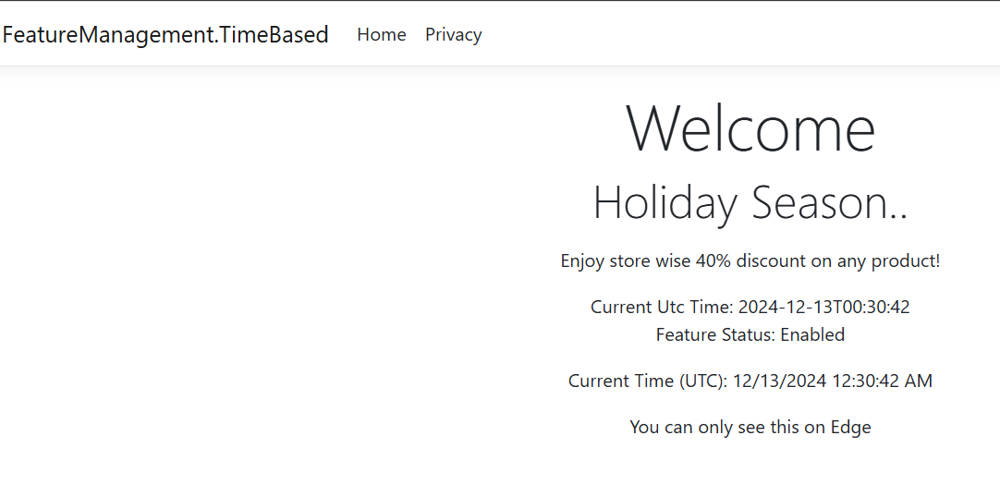

## Setting up Time-based Feature using FeatureManagemet Feature Flags


**Scenario**: During the Holidays season we need to display a banner in the portal for the discount. This discount display needs to shown for a period of time and removed automatically. We can use the TimeWindow based Feature flag.

Define the below AppSettings.json

```json
"FeatureManagement": {

  "HolidayDiscount": {
    "EnabledFor": [
      {
        "Name": "TimeWindow",
        "Parameters": {
          "Start": "2024-12-12T00:00:00Z",
          "End": "2025-01-05T23:59:59Z"
        }
      }
    ]
  }
}
```


Create a Configuration in Azure


Custom Feature Filter: Browser filter to show only in th Edge Browser.


Random Flag ; 50 percentage you can see the footer section with link.

