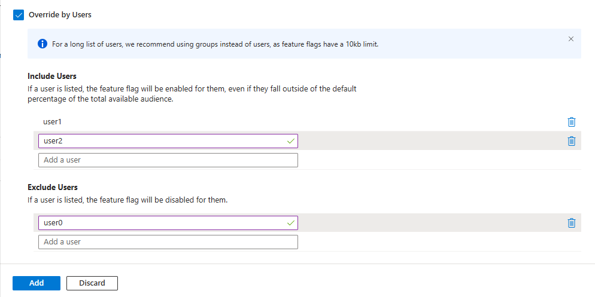

# Target Audience Feature Management using Azure App Configuration

**Create User Secrets to Store the Azure App Configuration Connection String**
```bash
dotnet user-secrets init
dotnet user-secrets set ConnectionStrings:AppConfiguration "<your-App-Configuration-connection-string>"
```
Add Nuget Package references to the below packages

```bash
dotnet add package Microsoft.Azure.AppConfiguration.AspNetCore
dotnet add package Microsoft.FeatureManagement.AspNetCore
```
If you want to use the DefaultCredentials and AppConfiguration 
endpoint alone, add the extra package

```bash
dotnet add package Azure.Identity
dotnet user-secrets set Endpoints:AppConfiguration "<your-App-Configuration-endpoint>"
```

## Azure App Configuration

Create App Configuration


Create Feature Flags under Feature manager


Created UseV1ProdApi Feature Flag


Created UseV2ProdApi Feature Flag with Feature Filter Option


Click the Create + icon
 - In the Filter Type dropdown select "Targeting filter"
 - Set Default Percentage Slider value to 0
 - Check Override by Groups and enter the below group names
    - beta-testers
    - internal-users
- Leave the Percentage to 100

- Check the Override by Users
- Enter the below users
    - user1
    - user2
- On Exclude Users, enter
    - user0
Click Add to Add the filter
Click Apply Button to create the Feature




**Features**:


