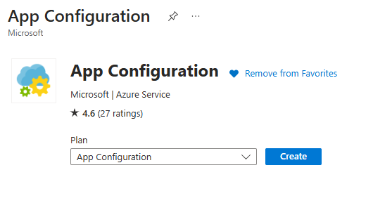
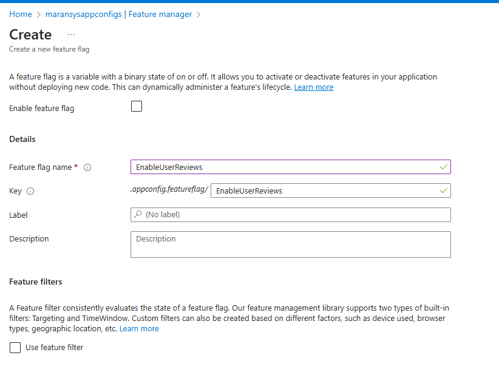
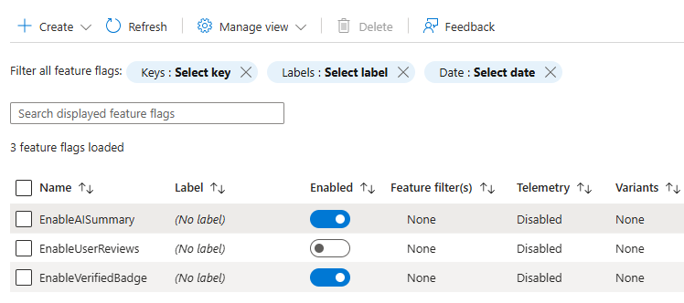
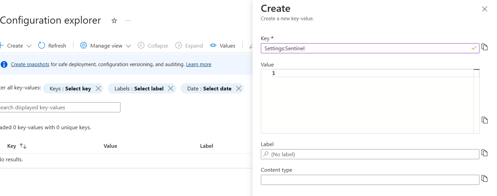
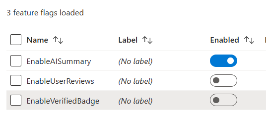
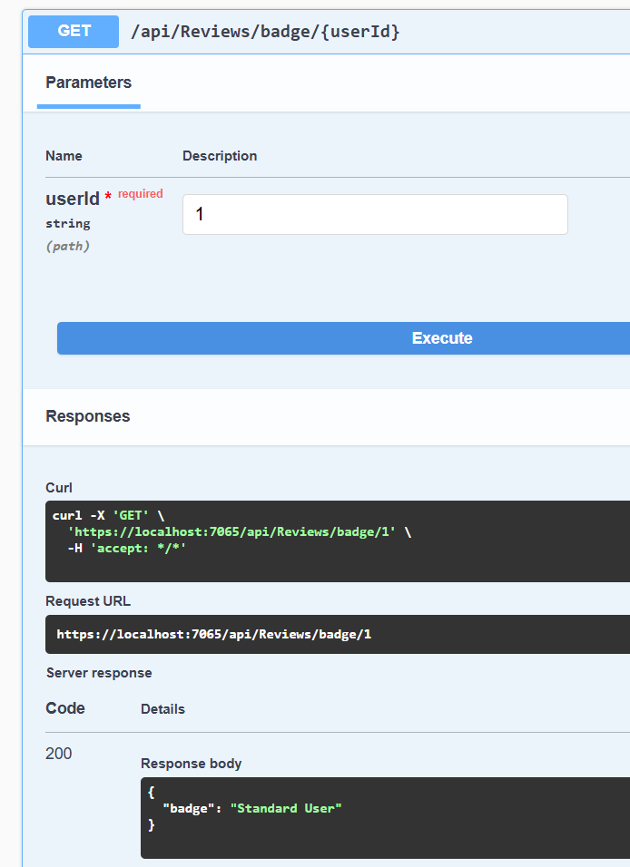
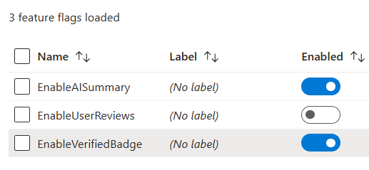
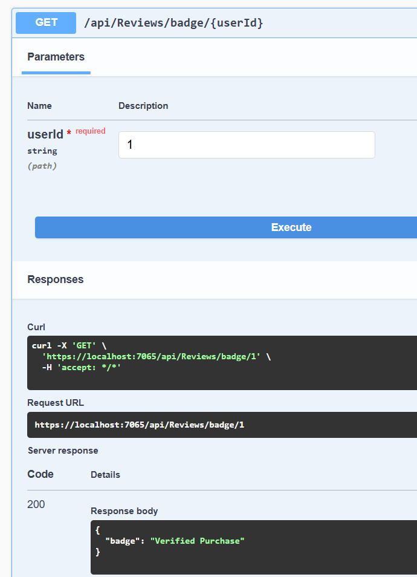

## FeatureFlag using Azure App Configuration

Feature flags (also known as feature toggles) allow you to enable or disable specific features or functionality in your application at runtime without requiring code changes or deployments. In .NET, this is commonly managed using the Microsoft.FeatureManagement library, which provides a structured way to implement and manage feature flags.

|**Aspect**|**Boolean Flag in Configuration**|**Feature Flags**|
| :--|:---|:--|
|Purpose|Basic on/off switch for a feature.|Advanced feature control with additional functionalities.|
|Flexibility|Static, requires app restart for changes.|Dynamic, can be updated at runtime without app restart.|
|Granularity|Limited to simple true/false logic.|Supports complex rules, conditions, and gradual rollouts|
|Management|Managed in appsettings or other config files.|Managed via centralized feature management tools (Azure App Configuration, LaunchDarkly, etc.)|
|Rollout Scenarios|Binary enable/disable for all users.|Conditional rollout (e.g., user segments, percentage rollouts).|
|Runtime Evaluation|Typically evaluated at startup or manually coded.|Evaluated dynamically during runtime using conditions.|
|Kill Switch|Requires a config file update and restart.|Can disable features immediately without downtime.|
|Testing Support|Limited support for A/B testing.|Built-in support for A/B testing and staged|
|Tooling Integration|Basic configuration tools.|Integrated with feature management platforms and dashboards.|


**Create the App Configuration in Azure**



Under Feature Manager, create the Featre Flags needed and set the toggle.






**"Settings:Sentinel"**
 - "Settings:Sentinel" is a sentinel key (or sentinel value) used in Azure App Configuration as a trigger for configuration refresh. 
 - It acts as a control mechanism to force configuration updates across your application

 ```csharp
 refresh.Register("Settings:Sentinel", refreshAll: true)
       .SetCacheExpiration(TimeSpan.FromSeconds(5));
```
- When the value of "Settings:Sentinel" changes in Azure App Configuration, it triggers a refresh of ALL configuration values (because refreshAll: true). This includes feature flags and other configuration settings

**Create the Key**:


- When you want to force all clients to refresh their configuration:
   - Simply update the sentinel key's value.
   - All applications will pick up the change within the cache expiration window.

**Testing a Key**:





- Toggle the Feature Switch now.





## Benefits of using Feature Flags
1. Dynamic Control:
   - Enable/disable features in real time without deploying new code.
2. A/B Testing:
   - Test new features with specific user groups.
3. Safe Rollouts:
   - Gradually roll out features to minimize risk.
4. Environment Management:
   - Use different configurations for development, staging, and production environments.

## Key Advantage of Feature Flags over Boolean setting in AppConfiguration
- **Dynamic Evaluation**: Feature flags evaluate dynamically at runtime, pulling data from external sources or configuration systems.
- **No App Restart**: Tools like Azure App Configuration or LaunchDarkly handle updates in real-time without requiring an app restart.
- **Centralized Management**: Feature states are managed centrally, making them accessible across multiple instances of the application.
- **Granular Control**: Feature flags allow more complex logic (e.g., user roles, geo-locations, time-based rules), which static boolean flags cannot handle.
