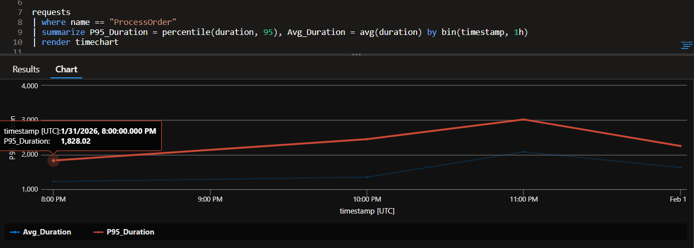
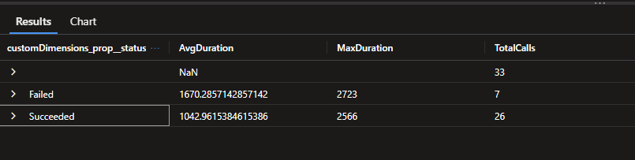
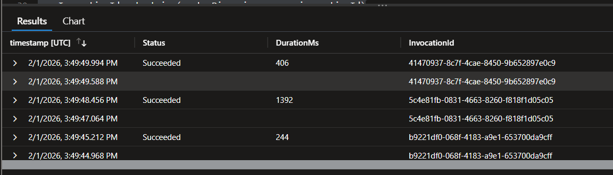

# KQL - KUSTO QUERY LANGUAGE

1. Create the Application Insights in the Azure
2. Copy the connection strings from the Overview blade.
3. Update the localsettings.json file

```bash
#Find all logs specific to a OrderId
traces
| where customDimensions["OrderId"] == "PASTE_YOUR_GUID_HERE"
| project timestamp, message, severityLevel


requests
| order by timestamp desc

# 
traces
| where timestamp > ago(30m)
| where customDimensions.UserType != "VIP"
| where severityLevel >= 3 // 3 is Error
| project timestamp, message, customDimensions.OrderId

```

Level 2: Performance & Metrics (Aggregations)Goal: Understand how the function behaves over time.Find the 95th percentile duration (P95):In .NET terms: "95% of my users experience a latency of $x$ or less."

```bash
requests
| where name == "ProcessOrder"
| summarize P95_Duration = percentile(duration, 95), Avg_Duration = avg(duration) by bin(timestamp, 1h)
| render timechart
```


- Count total revenue by User Type (VIP vs Standard): This demonstrates extracting values from customDimensions.
```bash

```

- List last 30 Failure requests
```bash
requests
| where success == False
| sort  by timestamp desc
| take 30
```


- Find AverageDuration, MaxDuaration and TotalCalls 

```bash
traces
| where customDimensions.prop__functionName == "Functions.ProcessOrder"
| extend Duration = toint(customDimensions.prop__executionDuration)
| summarize 
    AvgDuration = avg(Duration), 
    MaxDuration = max(Duration), 
    TotalCalls = count() 
    by tostring(customDimensions.prop__status)
```



```bash
traces
| where customDimensions.prop__functionName == "Functions.ProcessOrder"
| project 
    timestamp, 
    Status = tostring(customDimensions.prop__status), 
    DurationMs = toint(customDimensions.prop__executionDuration),
    InvocationId = tostring(customDimensions.prop__invocationId)
```
